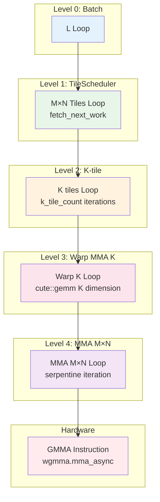

This article explains CUTLASS SM90 GEMM M/N/K dimension partitioning and loop hierarchy, from ProblemShape to innermost MMA instructions.

<!-- more -->

## 1. 整体 Loop 层次结构

CUTLASS SM90 GEMM 将 `ProblemShape (M, N, K)` 切分为多层循环：

```
Level 0: Batch Loop (L dimension)
+-- Level 1: Tile Scheduler Loop (M_tiles x N_tiles)
    +-- Level 2: K-tile Loop (over K dimension)
        +-- Level 3: Warp MMA K Loop (within one K-tile)
            +-- Level 4: MMA Atom (hardware instruction)
```

### 1.1 伪代码总览

```cpp
// === Level 0: Batch Loop ===
for (int l = 0; l < L; ++l) {                    // Batch dimension

  // === Level 1: TileScheduler Loop (M/N tiles) ===
  while (work_tile_info.is_valid()) {            // Persistent kernel style
    auto [m_tile, n_tile] = work_tile_info;      // 由 TileScheduler 分配

    // === Level 2: K-tile Loop ===
    for (int k_tile = 0; k_tile < K_tiles; ++k_tile) {
      // Producer: TMA load A[m_tile, k_tile], B[n_tile, k_tile] → SMEM
      // Consumer: MMA compute

      // === Level 3: Warp MMA K Loop (within SMEM tile) ===
      for (int k_block = 0; k_block < MMA_K; ++k_block) {

        // === Level 4: MMA Atom ===
        for (int mma_m = 0; mma_m < MMA_M; ++mma_m) {
          for (int mma_n = 0; mma_n < MMA_N; ++mma_n) {
            mma(D[mma_m,mma_n], A[mma_m,k_block], B[mma_n,k_block], C[mma_m,mma_n]);
          }
        }
      }
    }

    work_tile_info = scheduler.fetch_next_work();  // 获取下一个 tile
  }
}
```

---

## 2. 维度切分关系

### 2.1 从 ProblemShape 到各层循环

```
ProblemShape: (M, N, K, L)
                |  |  |  |
                v  v  v  v
+-----------------------------------------------------------+
| TileShape: (BLK_M, BLK_N, BLK_K)                          |
|   e.g.: (128, 256, 64)                                    |
|                                                           |
| M_tiles = ceil(M / BLK_M)    // TileScheduler iterates    |
| N_tiles = ceil(N / BLK_N)    // TileScheduler iterates    |
| K_tiles = ceil(K / BLK_K)    // Mainloop K-tile loop      |
+-----------------------------------------------------------+
                |
                v
+-----------------------------------------------------------+
| ClusterShape: (Cluster_M, Cluster_N, 1)                   |
|   e.g.: (2, 1, 1)                                         |
|                                                           |
| Multiple CTAs form a Cluster, sharing data (TMA Multicast)|
| CTAs per Cluster = Cluster_M x Cluster_N                  |
+-----------------------------------------------------------+
                |
                v
+-----------------------------------------------------------+
| MMA Atom Shape: shape processed per MMA instruction       |
|   e.g. SM90 GMMA: M16N8K16 (FP16)                         |
|                                                           |
| MMA_M = BLK_M / atom_M    // M iterations within warp     |
| MMA_N = BLK_N / atom_N    // N iterations within warp     |
| MMA_K = BLK_K / atom_K    // K iterations within warp     |
+-----------------------------------------------------------+
```

### 2.2 数值示例

假设：
- `ProblemShape = (4096, 4096, 4096, 1)`
- `TileShape = (128, 256, 64)`
- `ClusterShape = (2, 1, 1)`
- `MMA Atom = M64N256K16` (GMMA)

```
M_tiles = 4096 / 128 = 32
N_tiles = 4096 / 256 = 16
K_tiles = 4096 / 64  = 64

总 Cluster 数 = 32/2 × 16/1 = 16 × 16 = 256 clusters
每 Cluster 内 CTA 数 = 2 × 1 = 2
总 CTA 数 = 256 × 2 = 512

每个 K-tile 内的 MMA K 迭代 = 64 / 16 = 4
```

---

## 3. Level 1: TileScheduler Loop

### 3.1 代码位置

源码：[sm90_gemm_tma_warpspecialized_cooperative.hpp:591-647](https://github.com/NVIDIA/cutlass/blob/main/include/cutlass/gemm/kernel/sm90_gemm_tma_warpspecialized_cooperative.hpp#L591-L647)

```cpp
// Mainloop Producer Warp
if (producer_warp_role == ProducerWarpRole::Mainloop) {
  while (work_tile_info.is_valid()) {
    // 从 WorkTileInfo 获取 M/N/L 坐标
    auto m_coord = idx2crd(work_tile_info.M_idx, shape<2>(gA_mkl));
    auto n_coord = idx2crd(work_tile_info.N_idx, shape<2>(gB_nkl));
    auto l_coord = idx2crd(work_tile_info.L_idx, shape<4>(gB_nkl));
    auto blk_coord = make_coord(m_coord, n_coord, _, l_coord);

    // 获取 K-tile 数量
    auto work_k_tile_count = TileScheduler::get_work_k_tile_count(
        work_tile_info, problem_shape_MNKL, blk_shape);

    // K-tile 迭代器
    auto k_tile_iter = cute::make_coord_iterator(
        idx2crd(work_k_tile_start, shape<3>(gA_mkl)), shape<3>(gA_mkl));

    // 调用 mainloop.load() 执行 K-tile 循环
    collective_mainloop.load(..., k_tile_iter, work_k_tile_count, ...);

    // 获取下一个 work tile
    auto [next_work_tile_info, increment_pipe] = scheduler.fetch_next_work(...);
    work_tile_info = next_work_tile_info;
  }
}
```

### 3.2 WorkTileInfo 结构

源码：[static_tile_scheduler.hpp:55-84](https://github.com/NVIDIA/cutlass/blob/main/include/cutlass/gemm/kernel/static_tile_scheduler.hpp#L55-L84)

```cpp
struct WorkTileInfo {
  int32_t M_idx = 0;    // M tile 索引 (以 CTA 为单位)
  int32_t N_idx = 0;    // N tile 索引 (以 CTA 为单位)
  int32_t L_idx = 0;    // Batch 索引
  bool is_valid_tile = false;
};
```

### 3.3 Tile 总数计算

源码：[static_tile_scheduler.hpp:251-260](https://github.com/NVIDIA/cutlass/blob/main/include/cutlass/gemm/kernel/static_tile_scheduler.hpp#L251-L260)

```cpp
template<class ProblemShapeMNKL, class BlockShape, class ClusterShape>
static dim3 get_tiled_cta_shape_mnl(...) {
  // M 方向的 CTA 数量
  auto cta_m = cute::size(cute::ceil_div(cute::shape<0>(problem_shape_mnkl),
                                          cute::shape<0>(cta_shape)));
  // N 方向的 CTA 数量
  auto cta_n = cute::size(cute::ceil_div(cute::shape<1>(problem_shape_mnkl),
                                          cute::shape<1>(cta_shape)));
  // 返回 (cta_m, cta_n, L)
  return Params::get_tiled_cta_shape_mnl(..., cta_m, cta_n);
}
```

---

## 4. Level 2: K-tile Loop (Producer)

### 4.1 代码位置

源码：[sm90_mma_tma_gmma_ss_warpspecialized.hpp:370-391](https://github.com/NVIDIA/cutlass/blob/main/include/cutlass/gemm/collective/sm90_mma_tma_gmma_ss_warpspecialized.hpp#L370-L391)

```cpp
// Producer: TMA 加载 A 和 B 到 SMEM
CUTLASS_PRAGMA_NO_UNROLL
for ( ; k_tile_count > 0; --k_tile_count) {
  // 等待 SMEM buffer 可写
  pipeline.producer_acquire(smem_pipe_write);

  // 获取当前 stage 的 barrier
  BarrierType* tma_barrier = pipeline.producer_get_barrier(smem_pipe_write);
  int write_stage = smem_pipe_write.index();

  // TMA 加载 A[m, k_tile] 和 B[n, k_tile] 到 SMEM
  copy(mainloop_params.tma_load_a.with(*tma_barrier, mcast_mask_a),
       tAgA(_,_,_,*k_tile_iter), tAsA(_,_,_,write_stage));
  copy(mainloop_params.tma_load_b.with(*tma_barrier, mcast_mask_b),
       tBgB(_,_,_,*k_tile_iter), tBsB(_,_,_,write_stage));

  ++k_tile_iter;      // 下一个 K tile
  ++smem_pipe_write;  // 下一个 pipeline stage
}
```

### 4.2 K-tile 数量计算

源码：[static_tile_scheduler.hpp:445-452](https://github.com/NVIDIA/cutlass/blob/main/include/cutlass/gemm/kernel/static_tile_scheduler.hpp#L445-L452)

```cpp
template <class ProblemShape, class TileShape>
static int get_work_k_tile_count(WorkTileInfo const& work_tile_info,
                                  ProblemShape problem_shape,
                                  TileShape tile_shape) {
  // K_tiles = ceil(K / BLK_K)
  return cute::size(cute::ceil_div(cute::get<2>(problem_shape),
                                    cute::get<2>(tile_shape)));
}
```

---

## 5. Level 2: K-tile Loop (Consumer)

### 5.1 代码位置

源码：[sm90_mma_tma_gmma_ss_warpspecialized.hpp:528-556](https://github.com/NVIDIA/cutlass/blob/main/include/cutlass/gemm/collective/sm90_mma_tma_gmma_ss_warpspecialized.hpp#L528-L556)

```cpp
// Consumer: MMA 计算
CUTLASS_PRAGMA_NO_UNROLL
for ( ; k_tile_count > 0; --k_tile_count) {
  // 等待 SMEM 数据就绪
  auto barrier_token = pipeline.consumer_try_wait(smem_pipe_read);
  pipeline.consumer_wait(smem_pipe_read, barrier_token);

  int read_stage = smem_pipe_read.index();

  warpgroup_fence_operand(accum);
  warpgroup_arrive();

  // Level 3: 调用 cute::gemm 执行 Warp MMA K Loop
  cute::gemm(tiled_mma, tCrA(_,_,_,read_stage), tCrB(_,_,_,read_stage), accum);

  warpgroup_commit_batch();
  warpgroup_wait<K_PIPE_MMAS>();
  warpgroup_fence_operand(accum);

  // 释放 SMEM buffer
  pipeline.consumer_release(smem_pipe_release);

  ++smem_pipe_read;
  ++smem_pipe_release;
}
```

---

## 6. Level 3: Warp MMA K Loop

### 6.1 代码位置

源码：[cute/algorithm/gemm.hpp:388-416](https://github.com/NVIDIA/cutlass/blob/main/include/cute/algorithm/gemm.hpp#L388-L416)

```cpp
// Dispatch [5]: (V,M,K) x (V,N,K) => (V,M,N)
template <...>
void gemm(MMA_Atom<MMA> const& mma,
          Tensor<TD, DLayout>& D,       // (V,M,N)
          Tensor<TA, ALayout> const& A, // (V,M,K)
          Tensor<TB, BLayout> const& B, // (V,N,K)
          Tensor<TC, CLayout> const& C) // (V,M,N)
{
  auto K = size<2>(A);  // K 维度大小 (MMA_K iterations)

  CUTE_UNROLL
  for (int k = 0; k < K; ++k) {
    // 对每个 k_block 调用 Level 4 的 (V,M) x (V,N) => (V,M,N)
    gemm(mma, D, A(_,_,k), B(_,_,k), C);
  }
}
```

这个循环在 SMEM tile 内部迭代 K 方向的 MMA blocks。

---

## 7. Level 4: MMA M/N Loop

### 7.1 代码位置

源码：[cute/algorithm/gemm.hpp:263-386](https://github.com/NVIDIA/cutlass/blob/main/include/cute/algorithm/gemm.hpp#L263-L386)

```cpp
// Dispatch [4]: (V,M) x (V,N) => (V,M,N)
// 使用 serpentine 遍历优化寄存器复用
template <...>
void gemm(MMA_Atom<MMA> const& mma,
          Tensor<TD, DLayout>& D,       // (V,M,N)
          Tensor<TA, ALayout> const& A, // (V,M)
          Tensor<TB, BLayout> const& B, // (V,N)
          Tensor<TC, CLayout> const& C) // (V,M,N)
{
  auto M = size<1>(A);
  auto N = size<1>(B);

  // Row-major serpentine iteration (优化寄存器复用)
  CUTE_UNROLL
  for (int m = 0; m < M; ++m) {
    CUTE_UNROLL
    for (int n = 0; n < N; ++n) {
      int ns = (m & 1) ? N-1-n : n;  // Serpentine 坐标
      // Level 4: 调用单个 MMA 指令
      gemm(mma, D(_,m,ns), A(_,m), B(_,ns), C(_,m,ns));
    }
  }
}
```

### 7.2 Serpentine 遍历模式

```
m=0: n → 0, 1, 2, 3    (正向)
m=1: n → 3, 2, 1, 0    (反向)
m=2: n → 0, 1, 2, 3    (正向)
m=3: n → 3, 2, 1, 0    (反向)
```

这种遍历模式最大化了 A 寄存器的复用（同一行 m 复用 A 值）。

---

## 8. 完整循环层次图



---

## 9. 代码对照表

| Loop Level | 代码位置 | 循环变量 | 迭代次数 |
|------------|----------|----------|----------|
| **L0: Batch** | Kernel launch | `L_idx` | `L` |
| **L1: Tile M×N** | [cooperative.hpp:591](https://github.com/NVIDIA/cutlass/blob/main/include/cutlass/gemm/kernel/sm90_gemm_tma_warpspecialized_cooperative.hpp#L591) | `work_tile_info` | `M_tiles × N_tiles` |
| **L2: K-tile** | [warpspecialized.hpp:372](https://github.com/NVIDIA/cutlass/blob/main/include/cutlass/gemm/collective/sm90_mma_tma_gmma_ss_warpspecialized.hpp#L372) | `k_tile_count` | `ceil(K / BLK_K)` |
| **L3: Warp K** | [gemm.hpp:412](https://github.com/NVIDIA/cutlass/blob/main/include/cute/algorithm/gemm.hpp#L412) | `k` | `BLK_K / atom_K` |
| **L4: MMA M×N** | [gemm.hpp:294](https://github.com/NVIDIA/cutlass/blob/main/include/cute/algorithm/gemm.hpp#L294) | `m, n` | `MMA_M × MMA_N` |

---

## 10. Pipeline 与 Loop 的交互

```
Producer (TMA Load)              Consumer (MMA Compute)
---------------------            -------------------------

for k_tile in K_tiles:           for k_tile in K_tiles:
  |                                |
  +- producer_acquire(stage)       +- consumer_wait(stage)
  |                                |
  +- TMA_load_A[k_tile]            +- for k in MMA_K:
  +- TMA_load_B[k_tile]            |     for m in MMA_M:
  |                                |       for n in MMA_N:
  +- (implicit commit via TMA)     |         GMMA(A,B,C)
  |                                |
  +- ++stage                       +- consumer_release(stage)
                                   +- ++stage
```

---

## 11. 关键要点总结

1. **五层循环结构**：Batch → Tile M×N → K-tile → Warp K → MMA M×N

2. **TileScheduler 管理 M×N**：persistent kernel 风格，动态获取 work tiles

3. **K-tile 循环在 Mainloop**：Producer/Consumer 异步执行，Pipeline 同步

4. **Warp MMA K 在 cute::gemm**：展开循环，处理 SMEM tile 内的 K blocks

5. **Serpentine 遍历**：优化寄存器复用，减少 register spilling

## 12. 相关文档

- [Pipeline 与 mbarrier 深度解析](/2024/12/23/pipeline-barrier-ptx-mapping/) - Pipeline 同步机制
- [TMA Descriptor 深度解析](/2024/12/24/tma-descriptor-deep-dive/) - TMA 数据加载
- [Cooperative Kernel Pipeline 深度解析](/2024/12/24/cooperative-kernel-pipeline-deep-dive/) - Warp Specialization

---

## 参考资料

- [CUTLASS GitHub 仓库](https://github.com/NVIDIA/cutlass)
- [sm90_gemm_tma_warpspecialized_cooperative.hpp](https://github.com/NVIDIA/cutlass/blob/main/include/cutlass/gemm/kernel/sm90_gemm_tma_warpspecialized_cooperative.hpp)
- [sm90_mma_tma_gmma_ss_warpspecialized.hpp](https://github.com/NVIDIA/cutlass/blob/main/include/cutlass/gemm/collective/sm90_mma_tma_gmma_ss_warpspecialized.hpp)
- [cute/algorithm/gemm.hpp](https://github.com/NVIDIA/cutlass/blob/main/include/cute/algorithm/gemm.hpp)
- [static_tile_scheduler.hpp](https://github.com/NVIDIA/cutlass/blob/main/include/cutlass/gemm/kernel/static_tile_scheduler.hpp)
