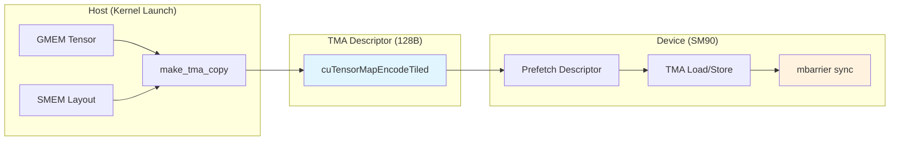
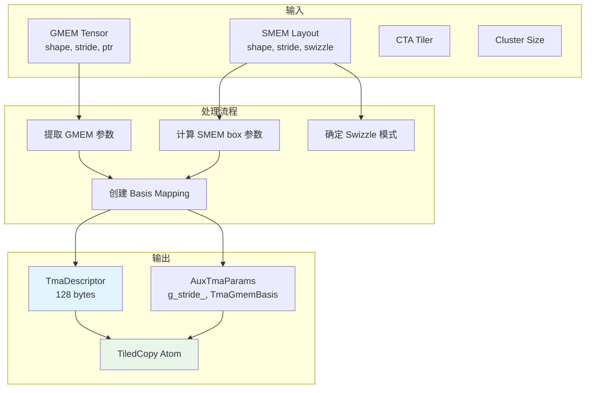
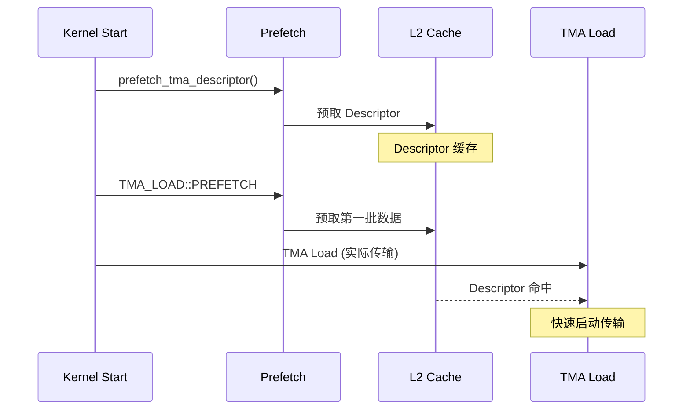
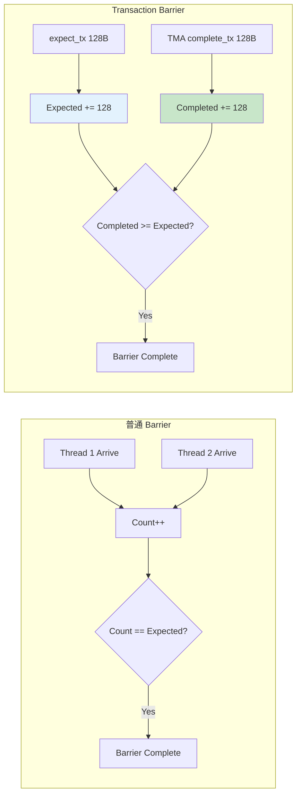
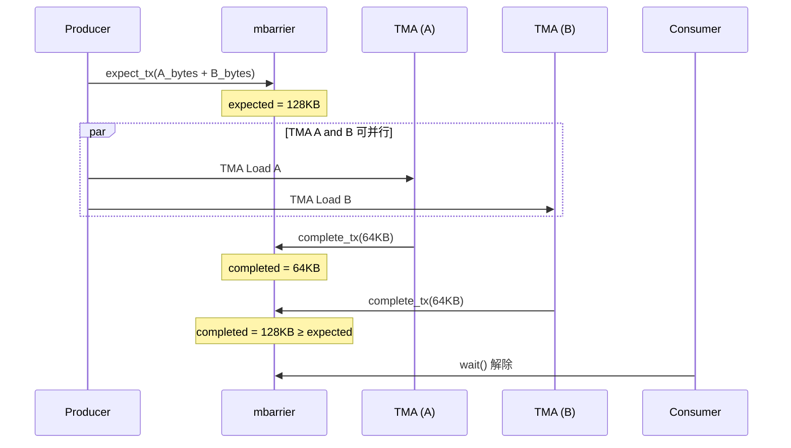
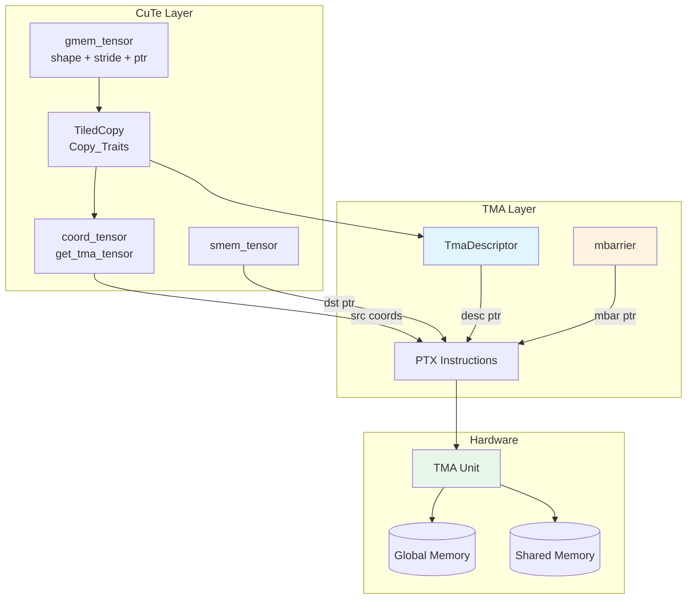

This article explains NVIDIA Hopper (SM90) TMA (Tensor Memory Accelerator) mechanism, including Descriptor construction, Prefetch, Copy instructions, and CuTe Tensor integration.

<!-- more -->

> **核心要点速览**
> 1. **TMA Descriptor**：128 字节结构，Host 端创建，Device 端使用
> 2. **Transaction Barrier**：用 `expect_tx` + `complete_tx` 跟踪字节数，非 arrive 次数
> 3. **A/B 共享 Barrier**：GEMM 中 A 和 B 共用一个 barrier，`complete_tx` 自动累加
> 4. **Prefetch**：预取 Descriptor 和数据到 L2 可提升性能
> 5. **PTX 指令**：`cp.async.bulk.tensor.Xd.shared::cluster.global.mbarrier::complete_tx::bytes`

## 1. TMA 概述

### 1.1 什么是 TMA

TMA（Tensor Memory Accelerator）是 NVIDIA Hopper (SM90) 架构引入的硬件加速单元，专门用于高效的张量数据传输。它的主要特点：

- **异步执行**：TMA 操作与 SM 计算完全异步，由专用硬件单元执行
- **硬件地址生成**：自动计算多维张量的内存地址，无需软件计算
- **支持复杂布局**：原生支持 swizzle、padding、stride 等复杂内存模式
- **Multicast 支持**：单次操作可向 cluster 内多个 CTA 广播数据

### 1.2 TMA vs 传统 Copy

| 特性 | 传统 Copy | TMA |
|-----|----------|-----|
| 地址计算 | 软件计算，占用寄存器 | 硬件计算，基于 Descriptor |
| 执行单元 | SM (CUDA Cores) | 专用 TMA 硬件单元 |
| 同步方式 | `__syncthreads()` | mbarrier |
| Swizzle | 软件实现 | 硬件原生支持 |
| 多维支持 | 需要手动展开 | 原生 1D-5D |

### 1.3 TMA 工作流程概览



---

## 2. TMA Descriptor 结构

### 2.1 类型定义

TMA Descriptor 是一个 128 字节的数据结构，存储了完整的张量传输信息：

```cpp
// 源码: include/cute/arch/copy_sm90_desc.hpp:291-297
#if (__CUDACC_VER_MAJOR__ >= 12) && !defined(__CUDACC_RTC__)
  using TmaDescriptor = CUtensorMap;       // CUDA 12.0+ 使用原生类型
  using Im2ColTmaDescriptor = CUtensorMap;
#else
  using TmaDescriptor = struct alignas(64) { char bytes[128]; };  // 128字节，64字节对齐
  using Im2ColTmaDescriptor = struct alignas(64) { char bytes[128]; };
#endif
```

**关键约束**：
- 大小：128 字节
- 对齐：64 字节对齐（硬件要求）
- 存储位置：通常在 constant memory 或 global memory

### 2.2 Descriptor 编码参数

Descriptor 通过 `cuTensorMapEncodeTiled()` CUDA Driver API 创建：

```cpp
// 源码: include/cute/atom/copy_traits_sm90_tma.hpp:1024-1053
CUresult result = cuTensorMapEncodeTiled(
    tma_desc,              // 输出：TMA descriptor 指针
    tma_format,            // 数据类型 (FP32, FP16, BF16, INT8, etc.)
    tma_dim,               // 维度数 (1-5)
    gmem_address,          // 全局内存基地址 (16字节对齐)
    gmem_prob_shape,       // 各维度大小 (uint32_t[5])
    gmem_prob_stride + 1,  // 各维度步长 (uint64_t[5], 字节为单位)
    smem_box_shape,        // SMEM tile 各维度大小 (uint32_t[5], 最大256)
    smem_box_stride,       // SMEM tile 步长 (uint32_t[5])
    tma_interleave,        // 交错模式
    tma_swizzle,           // Swizzle 模式 (32B, 64B, 128B)
    tma_l2Promotion,       // L2 缓存策略
    tma_oobFill            // 越界填充值 (ZERO 或 CONSTANT)
);
```

### 2.3 参数详解

| 参数 | 类型 | 约束 | 描述 |
|-----|------|------|------|
| `gmem_address` | `void*` | 16 字节对齐 | 全局内存基地址 |
| `gmem_prob_shape[i]` | `uint32_t` | 1 ~ 2^32 | 第 i 维的元素数 |
| `gmem_prob_stride[i]` | `uint64_t` | 16 字节对齐，最大 2^40 | 第 i 维的字节步长 |
| `smem_box_shape[i]` | `uint32_t` | 1 ~ 256 | SMEM tile 第 i 维大小 |
| `smem_box_stride[i]` | `uint32_t` | 1 ~ 8 | SMEM tile 第 i 维步长 |

### 2.4 Swizzle 模式

Swizzle 用于优化 shared memory bank conflict：

```cpp
// Swizzle 模式选项
CU_TENSOR_MAP_SWIZZLE_NONE    // 无 swizzle
CU_TENSOR_MAP_SWIZZLE_32B     // 32 字节 swizzle
CU_TENSOR_MAP_SWIZZLE_64B     // 64 字节 swizzle
CU_TENSOR_MAP_SWIZZLE_128B    // 128 字节 swizzle
```

### 2.5 数据类型映射

```cpp
// 源码: include/cute/atom/copy_traits_sm90_tma.hpp:906-918
// TMA 数据格式映射
CU_TENSOR_MAP_DATA_TYPE_UINT8          // uint8_t, int8_t
CU_TENSOR_MAP_DATA_TYPE_UINT16         // uint16_t, int16_t, half_t, bfloat16_t
CU_TENSOR_MAP_DATA_TYPE_UINT32         // uint32_t, int32_t, float
CU_TENSOR_MAP_DATA_TYPE_UINT64         // uint64_t, int64_t, double
CU_TENSOR_MAP_DATA_TYPE_FLOAT16        // half_t (FP16 专用)
CU_TENSOR_MAP_DATA_TYPE_FLOAT32        // float
CU_TENSOR_MAP_DATA_TYPE_FLOAT64        // double
CU_TENSOR_MAP_DATA_TYPE_BFLOAT16       // bfloat16_t
CU_TENSOR_MAP_DATA_TYPE_FLOAT32_FTZ    // TF32 (Tensor Float 32)
```

---

## 3. TMA Descriptor 创建流程

### 3.1 make_tma_copy API

CUTLASS/CuTe 提供了高层 API 来创建 TMA copy atom：

```cpp
// 源码: include/cute/atom/copy_traits_sm90_tma.hpp:1221-1336
template <class TmaInternalType = void,
          class CopyOp,
          class GEngine, class GLayout,
          class SLayout,
          class CTA_Tiler,
          class Cluster_Size>
CUTE_HOST_RTC
auto
make_tma_copy(CopyOp                  const& copy_op,      // SM90_TMA_LOAD 等
              Tensor<GEngine,GLayout> const& gtensor,      // 全局内存张量
              SLayout                 const& slayout,      // 共享内存布局
              CTA_Tiler               const& cta_tiler,    // CTA tile 大小
              Cluster_Size            const& cluster_size) // Cluster 大小
{
  // 1. 创建 CTA tile 和 cluster tile 的布局
  auto cta_v_tile = make_identity_layout(shape(gtensor)).compose(cta_tiler);
  auto cta_t_tile = make_layout(cluster_size);

  // 2. 推导 TMA 内部数据类型
  using TmaType = conditional_t<is_same<void, TmaInternalType>::value,
                                typename GEngine::value_type, TmaInternalType>;

  // 3. 调用内部实现创建 TiledCopy
  return detail::make_tma_copy_tiled<TmaType>(copy_op,
                                              gtensor, slayout,
                                              cta_t_tile, cta_v_tile);
}
```

### 3.2 使用示例

```cpp
// 创建全局内存张量 (M x K 矩阵)
auto gmem_tensor = make_tensor(
    make_gmem_ptr(ptr_A),
    make_shape(M, K),
    make_stride(K, Int<1>{})
);

// 定义共享内存布局 (128 x 64 tile，带 swizzle)
auto smem_layout = make_layout(
    make_shape(Int<128>{}, Int<64>{}),
    GenColMajor{}
);

// 创建 TMA copy atom
auto tma_load_a = make_tma_copy(
    SM90_TMA_LOAD{},           // TMA Load 操作
    gmem_tensor,               // 源：全局内存张量
    smem_layout,               // 目标：共享内存布局
    make_shape(Int<128>{}, Int<64>{}),  // CTA tile 大小
    Int<1>{}                   // Cluster 大小
);
```

### 3.3 内部创建流程



### 3.4 参数验证

TMA 对参数有严格要求，CUTLASS 在创建时会验证：

```cpp
// 源码: include/cute/atom/copy_traits_sm90_tma.hpp:949-979
// 地址对齐检查
assert((reinterpret_cast<uint64_t>(gmem_address) & 0b1111) == 0);  // 16B 对齐

// Shape 范围检查
assert(gmem_prob_shape[i] >= 1 && gmem_prob_shape[i] <= (1u << 32));

// Stride 对齐检查
assert((gmem_prob_stride[i] & 0b1111) == 0);  // 16B 对齐

// SMEM box 大小检查
assert(smem_box_shape[i] >= 1 && smem_box_shape[i] <= 256);
```

---

## 4. TMA Prefetch 机制

### 4.1 Descriptor Prefetch

将 TMA Descriptor 预取到 L2 缓存，加速后续 TMA 操作：

```cpp
// 源码: include/cute/arch/copy_sm90_desc.hpp:302-317
CUTE_HOST_DEVICE void
prefetch_tma_descriptor(TmaDescriptor const* desc_ptr)
{
#if defined(CUTE_ARCH_TMA_SM90_ENABLED)
  uint64_t gmem_int_desc = reinterpret_cast<uint64_t>(desc_ptr);
  asm volatile (
    "prefetch.tensormap [%0];"
    :
    : "l"(gmem_int_desc)
    : "memory");
#endif
}
```

**PTX 指令**：
```asm
prefetch.tensormap [desc_addr];
```

### 4.2 Data Prefetch

预取数据到 L2 缓存（不写入 SMEM）：

```cpp
// 源码: include/cute/arch/copy_sm90_tma.hpp:81-100
struct SM90_TMA_LOAD_1D::PREFETCH
{
  CUTE_HOST_DEVICE static void
  copy(void const* desc_ptr, int32_t const& crd0)
  {
#if defined(CUTE_ARCH_TMA_SM90_ENABLED)
    uint64_t gmem_int_desc = reinterpret_cast<uint64_t>(desc_ptr);
    asm volatile (
      "cp.async.bulk.prefetch.tensor.1d.L2.global [%0, {%1}];"
      :
      : "l"(gmem_int_desc), "r"(crd0)
      : "memory");
#endif
  }
};
```

**PTX 指令（1D-5D）**：
```asm
// 1D
cp.async.bulk.prefetch.tensor.1d.L2.global [desc], {crd0};

// 2D
cp.async.bulk.prefetch.tensor.2d.L2.global [desc], {crd0, crd1};

// 3D-5D 类似...
```

### 4.3 Prefetch 使用时机



---

## 5. TMA Copy 指令

### 5.1 TMA Load

从全局内存加载数据到共享内存：

```cpp
// 源码: include/cute/arch/copy_sm90_tma.hpp:49-79
struct SM90_TMA_LOAD_1D
{
  CUTE_HOST_DEVICE static void
  copy(void const* desc_ptr,     // TMA Descriptor 指针
       uint64_t* mbar_ptr,       // mbarrier 指针
       uint64_t cache_hint,      // L2 缓存提示
       void* smem_ptr,           // 目标 SMEM 地址
       int32_t const& crd0)      // 坐标
  {
#if defined(CUTE_ARCH_TMA_SM90_ENABLED)
    uint64_t gmem_int_desc = reinterpret_cast<uint64_t>(desc_ptr);
    uint32_t smem_int_mbar = cast_smem_ptr_to_uint(mbar_ptr);
    uint32_t smem_int_ptr  = cast_smem_ptr_to_uint(smem_ptr);

    asm volatile (
      "cp.async.bulk.tensor.1d.shared::cluster.global.mbarrier::complete_tx::bytes.L2::cache_hint"
      " [%0], [%1, {%3}], [%2], %4;"
      :
      : "r"(smem_int_ptr),      // 目标 SMEM
        "l"(gmem_int_desc),     // TMA Descriptor
        "r"(smem_int_mbar),     // mbarrier
        "r"(crd0),              // 坐标
        "l"(cache_hint)         // 缓存提示
      : "memory");
#endif
  }
};
```

**PTX 指令格式**：
```asm
// 基本格式
cp.async.bulk.tensor.{dim}d.{dst}.{src}.mbarrier::complete_tx::bytes [smem], [desc, {coords}], [mbar];

// 完整示例 (2D)
cp.async.bulk.tensor.2d.shared::cluster.global.mbarrier::complete_tx::bytes.L2::cache_hint
    [smem_ptr], [tma_desc, {crd0, crd1}], [mbar_ptr], cache_hint;
```

### 5.2 TMA Store

从共享内存存储数据到全局内存：

```cpp
// 源码: include/cute/arch/copy_sm90_tma.hpp:980-1001
struct SM90_TMA_STORE_2D
{
  CUTE_HOST_DEVICE static void
  copy(void const* desc_ptr,
       void const* smem_ptr,
       int32_t const& crd0, int32_t const& crd1)
  {
#if defined(CUTE_ARCH_TMA_SM90_ENABLED)
    uint64_t gmem_int_desc = reinterpret_cast<uint64_t>(desc_ptr);
    uint32_t smem_int_ptr  = cast_smem_ptr_to_uint(smem_ptr);

    asm volatile (
      "cp.async.bulk.tensor.2d.global.shared::cta.bulk_group [%0, {%2, %3}], [%1];"
      :
      : "l"(gmem_int_desc),    // TMA Descriptor
        "r"(smem_int_ptr),     // 源 SMEM
        "r"(crd0), "r"(crd1)   // 坐标
      : "memory");
#endif
  }
};
```

**PTX 指令格式**：
```asm
cp.async.bulk.tensor.{dim}d.global.shared::cta.bulk_group [desc, {coords}], [smem];
```

### 5.3 TMA Multicast

向 cluster 内多个 CTA 同时广播数据：

```cpp
// 源码: include/cute/arch/copy_sm90_tma.hpp:275-306
struct SM90_TMA_LOAD_MULTICAST_1D
{
  CUTE_HOST_DEVICE static void
  copy(void const* desc_ptr,
       uint64_t* mbar_ptr, uint64_t cache_hint,
       uint16_t multicast_mask,   // 目标 CTA 掩码
       void* smem_ptr,
       int32_t const& crd0)
  {
    asm volatile (
      "cp.async.bulk.tensor.1d.shared::cluster.global.mbarrier::complete_tx::bytes.multicast::cluster.L2::cache_hint"
      " [%0], [%1, {%4}], [%2], %3, %5;"
      :
      : "r"(smem_int_ptr), "l"(gmem_int_desc), "r"(smem_int_mbar),
        "h"(multicast_mask), "r"(crd0), "l"(cache_hint)
      : "memory");
  }
};
```

### 5.4 TMA Fence/Commit/Wait

用于 TMA Store 的同步控制：

```cpp
// 源码: include/cute/arch/copy_sm90_tma.hpp:1213-1274

// Fence: 确保之前的 SMEM 写入完成
CUTE_HOST_DEVICE static void
tma_store_fence() {
  asm volatile ("fence.proxy.async.shared::cta;");
}

// Commit: 标记一组 TMA store 完成
CUTE_HOST_DEVICE static void
tma_store_arrive() {
  asm volatile("cp.async.bulk.commit_group;");
}

// Wait: 等待最多 Count 个未完成的 TMA store
template <int Count>
CUTE_HOST_DEVICE static void
tma_store_wait() {
  asm volatile("cp.async.bulk.wait_group.read %0;" : : "n"(Count) : "memory");
}
```

### 5.5 TMA Load vs Store 对比

| 特性 | TMA Load | TMA Store |
|-----|----------|-----------|
| 方向 | GMEM → SMEM | SMEM → GMEM |
| 同步机制 | mbarrier | bulk_group + wait |
| Multicast | 支持 | 不支持 |
| Scope | `shared::cluster` | `shared::cta` |

---

## 6. TMA Transaction Barrier 与 expect_tx 机制

### 6.1 Transaction Barrier 概述

TMA 使用 **Transaction Barrier**（也称 `ClusterTransactionBarrier`）来同步异步数据传输。与普通 barrier 不同，Transaction Barrier 跟踪的是**传输的字节数**而非 arrive 次数。



### 6.2 expect_tx 与 complete_tx 配对

Transaction Barrier 使用 **expect_tx** 和 **complete_tx** 两个操作来跟踪传输进度：

| 操作 | 执行者 | 作用 | PTX 指令 |
|-----|--------|------|---------|
| `expect_tx(bytes)` | Producer (CPU thread) | 声明期望接收的字节数 | `mbarrier.arrive.expect_tx.shared::cta.b64` |
| `complete_tx(bytes)` | TMA 硬件 | 报告已完成传输的字节数 | TMA 指令中 `.mbarrier::complete_tx::bytes` 修饰符 |

**关键点**：当 `completed_bytes >= expected_bytes` 时，barrier 翻转（phase 变化），Consumer 的 wait 解除。

### 6.3 expect_tx 的 PTX 指令

```cpp
// 源码: include/cutlass/arch/barrier.h:580-593
static void arrive_and_expect_tx(ValueType const* smem_ptr, uint32_t transaction_bytes) {
#if CUDA_BARRIER_ENABLED
  uint32_t smem_addr = cute::cast_smem_ptr_to_uint(smem_ptr);
  asm volatile(
      "{\n\t"
      "mbarrier.arrive.expect_tx.shared::cta.b64 _, [%1], %0; \n\t"
      "}"
      :
      : "r"(transaction_bytes), "r"(smem_addr));
#endif
}
```

**PTX 指令解析**：
```asm
mbarrier.arrive.expect_tx.shared::cta.b64 _, [mbar_addr], tx_bytes;

// 组成部分：
// - mbarrier.arrive    : barrier arrive 操作
// - .expect_tx         : 同时设置期望的传输字节数
// - .shared::cta       : barrier 在 CTA 本地共享内存
// - .b64               : 64-bit barrier
// - tx_bytes           : 期望接收的字节数
```

### 6.4 TMA 指令中的 complete_tx

TMA Load 指令通过 `.mbarrier::complete_tx::bytes` 修饰符自动完成 complete_tx：

```asm
// TMA Load 指令格式
cp.async.bulk.tensor.2d.shared::cluster.global.mbarrier::complete_tx::bytes
    [smem_ptr], [tma_desc, {crd0, crd1}], [mbar_ptr];

// 修饰符解析：
// - .mbarrier::complete_tx::bytes : TMA 完成后自动对 mbarrier 调用 complete_tx
//   传输的实际字节数由 TMA descriptor 中的 box_shape 决定
```

**硬件自动完成**：TMA 硬件在数据传输完成后，会自动向指定的 mbarrier 报告完成的字节数，无需软件干预。

### 6.5 expect_tx 在 Pipeline 中的使用

在 CUTLASS Pipeline 中，Producer 在 acquire 阶段设置 expect_tx：

```cpp
// 源码: include/cutlass/pipeline/sm90_pipeline.hpp:508-517
CUTLASS_DEVICE
void producer_acquire(uint32_t stage, uint32_t phase) {
    detail::pipeline_check_is_producer(params_.role);
    // 等待 Consumer 释放 buffer
    empty_barrier_ptr_[stage].wait(phase);

    // 设置期望接收的字节数
    if (params_.is_leader) {
        full_barrier_ptr_[stage].arrive_and_expect_tx(params_.transaction_bytes);
    }
}
```

### 6.6 transaction_bytes 的计算

`transaction_bytes` 是每个 stage 期望传输的总字节数，由 tile 大小决定：

```cpp
// 示例：计算 TMA transaction bytes
static constexpr uint32_t TmaTransactionBytes =
    size(SmemLayoutA) * sizeof(ElementA) +  // A tile 字节数
    size(SmemLayoutB) * sizeof(ElementB);   // B tile 字节数

// 例如：A = 128x64 FP16, B = 64x128 FP16
// TmaTransactionBytes = (128*64 + 64*128) * 2 = 32768 bytes
```

### 6.7 A 和 B 共享同一个 Barrier：累加机制

**关键设计**：在 GEMM 中，A tile 和 B tile 的 TMA 操作**共享同一个 barrier**，而非各自使用独立的 barrier。

#### 6.7.1 为什么 A 和 B 共享 barrier？

从 CUTLASS 源码可以看到，`TmaTransactionBytes` 是 A 和 B 的**总和**：

```cpp
// 源码: include/cutlass/gemm/collective/sm90_mma_tma_warpspecialized_cooperative.hpp
static constexpr uint32_t TmaTransactionBytes =
    cutlass::bits_to_bytes(size<0>(SmemLayoutA{}) * size<1>(SmemLayoutA{}) * sizeof_bits<ElementA>::value) +
    cutlass::bits_to_bytes(size<0>(SmemLayoutB{}) * size<1>(SmemLayoutB{}) * sizeof_bits<ElementB>::value);
```

**原因**：
1. **GEMM 语义需要**：Consumer 必须等 A 和 B 都到齐才能执行 MMA，单独等待 A 没有意义
2. **减少 barrier 开销**：每个 barrier 占用 SMEM，减少同步点提高效率
3. **硬件支持累加**：Transaction barrier 天然支持多次 `complete_tx` 累加

#### 6.7.2 complete_tx 的累加机制

TMA 硬件的 `complete_tx` 支持**累加**，多个 TMA 操作的完成字节数会自动累加：



#### 6.7.3 代码体现

```cpp
// Producer
pipeline.producer_acquire(state);  // expect_tx(A_bytes + B_bytes)
copy(tma_load_A.with(*mbar), ...); // complete_tx(A_bytes)
copy(tma_load_B.with(*mbar), ...); // complete_tx(B_bytes)

// Consumer
pipeline.consumer_wait(state);     // 等待 completed >= expected
// A 和 B 都已就绪
```

### 6.8 expect_tx vs 普通 arrive 对比

| 维度 | 普通 Barrier (arrive) | Transaction Barrier (expect_tx) |
|-----|----------------------|--------------------------------|
| 跟踪单位 | arrive 次数 | 字节数 |
| 完成条件 | arrive_count == expected | completed_bytes >= expected_bytes |
| 典型用途 | 线程同步 | 异步数据传输 |
| 信号方 | 软件线程 | 硬件 (TMA) |
| PTX 指令 | `mbarrier.arrive` | `mbarrier.arrive.expect_tx` + TMA `.complete_tx` |

### 6.9 expect_tx 关键要点

1. **必须在 TMA 发起前调用**
2. **字节数必须匹配**：`expect_tx` 的字节数 = TMA 实际传输的字节数
3. **只有 leader 线程执行**
4. **支持累加**：多个 TMA 的 `complete_tx` 自动累加

---

## 7. CuTe Tensor 与 TMA 集成

### 7.1 Copy_Traits 结构

TMA 操作通过 `Copy_Traits` 封装：

```cpp
// 源码: include/cute/atom/copy_traits_sm90_tma.hpp:98-166
template <class NumBitsPerTMA, class AuxParams_>
struct Copy_Traits<SM90_TMA_LOAD, NumBitsPerTMA, AuxParams_>
{
  using ThrID     = Layout<_1>;           // 单线程执行
  using SrcLayout = Layout<Shape<_1,NumBitsPerTMA>>;
  using DstLayout = Layout<Shape<_1,NumBitsPerTMA>>;
  using RefLayout = SrcLayout;

  // TMA Descriptor 存储
  TmaDescriptor tma_desc_;

  // 辅助参数（stride 映射等）
  using AuxParams = AuxParams_;
  AuxParams aux_params_;

  // 获取 Descriptor 指针
  CUTE_HOST_DEVICE constexpr
  TmaDescriptor const* get_tma_descriptor() const {
    return &tma_desc_;
  }

  // 生成坐标张量
  template <class GShape>
  CUTE_HOST_DEVICE constexpr
  auto get_tma_tensor(GShape const& g_shape) const {
    return make_coord_tensor(make_layout(g_shape, aux_params_.g_stride_));
  }
};
```

### 7.2 AuxTmaParams 辅助参数

存储 GMEM 到 TMA 坐标的映射关系：

```cpp
// 源码: include/cute/atom/copy_traits_sm90_tma.hpp:50-58
template <class GmemTmaBasisStrides_, class TmaGmemBasis_, class TmaSwizzle_>
struct AuxTmaParams {
  using GmemStrides = GmemTmaBasisStrides_;
  GmemStrides g_stride_;           // GMEM mode → TMA coord 的映射

  using TmaGmemBasis = TmaGmemBasis_;  // 静态 basis 信息
  static_assert(is_static<TmaGmemBasis>::value);

  using TmaSwizzle = TmaSwizzle_;      // Swizzle 模式
  static_assert(is_static<TmaSwizzle>::value);
};
```

### 7.3 可执行 TMA Copy

运行时携带 barrier 和 cache hint：

```cpp
// 源码: include/cute/atom/copy_traits_sm90_tma.hpp:169-198
template <class NumBitsPerTMA>
struct Copy_Traits<SM90_TMA_LOAD_OP, NumBitsPerTMA>
  : TMA_LOAD_Unpack<SM90_TMA_LOAD_OP, NumBitsPerTMA>
{
  // 运行时参数
  tuple<
    TmaDescriptor const*,  // Descriptor 指针
    uint64_t*,             // mbarrier 指针
    uint64_t               // L2 cache hint
  > const opargs_;

  CUTE_HOST_DEVICE
  Copy_Traits(TmaDescriptor const* desc, uint64_t* mbar, uint64_t cache)
    : opargs_(desc, mbar, cache) {}
};
```

### 7.4 Copy Unpack 执行

将 CuTe tensor copy 转换为 TMA 指令：

```cpp
// 源码: include/cute/atom/copy_traits_sm90_tma.hpp:60-87
template <class CopyOp, class... Args>
struct TMA_LOAD_Unpack
{
  template <class TS, class SLayout,
            class TD, class DLayout>
  CUTE_HOST_DEVICE friend constexpr void
  copy_unpack(Copy_Traits<CopyOp, Args...> const& traits,
              Tensor<TS,SLayout>           const& src,   // GMEM 坐标张量
              Tensor<TD,DLayout>                & dst)   // SMEM 数据张量
  {
    // 验证目标是共享内存
    static_assert(is_smem<TD>::value,
        "SM90_TMA_LOAD requires the destination be shared memory.");

    // 提取源坐标
    auto src_coord = src.data().coord_;

    // 获取目标指针
    void* dst_ptr = cute::raw_pointer_cast(dst.data());

    // 展开并调用 TMA 指令
    return detail::explode_tuple(detail::CallCOPY<CopyOp>{},
                                 traits.opargs_, ...,
                                 make_tuple(dst_ptr), ...,
                                 src_coord, ...);
  }
};
```

### 7.5 完整数据流



---

## 8. 完整使用示例

### 8.1 创建 TMA Copy

```cpp
// 步骤 1: 定义矩阵参数
constexpr int M = 4096;
constexpr int K = 4096;
constexpr int TILE_M = 128;
constexpr int TILE_K = 64;

// 步骤 2: 创建全局内存张量
half_t* ptr_A = ...;  // 设备内存指针
auto gmem_A = make_tensor(
    make_gmem_ptr(ptr_A),
    make_shape(M, K),
    make_stride(K, Int<1>{})  // Row-major
);

// 步骤 3: 定义共享内存布局（带 swizzle）
auto smem_layout_A = composition(
    Swizzle<3, 3, 3>{},
    make_layout(make_shape(Int<TILE_M>{}, Int<TILE_K>{}),
                make_stride(Int<TILE_K>{}, Int<1>{}))
);

// 步骤 4: 创建 TMA copy atom
auto tma_load_A = make_tma_copy(
    SM90_TMA_LOAD{},
    gmem_A,
    smem_layout_A,
    make_shape(Int<TILE_M>{}, Int<TILE_K>{}),
    Int<1>{}
);
```

### 8.2 Kernel 中使用 TMA

```cpp
__global__ void kernel(TmaLoadA tma_load_A, ...) {
    // 共享内存
    extern __shared__ char smem[];
    half_t* smem_A = reinterpret_cast<half_t*>(smem);

    // mbarrier
    __shared__ uint64_t mbar;

    // 初始化 barrier (仅 thread 0)
    if (threadIdx.x == 0) {
        mbarrier_init(&mbar, 1);  // 期望 1 次 arrive

        // Prefetch descriptor
        prefetch_tma_descriptor(tma_load_A.get_tma_descriptor());
    }
    __syncthreads();

    // 计算 tile 坐标
    int tile_m = blockIdx.x;
    int tile_k = 0;

    // 获取坐标张量
    auto coord_tensor = tma_load_A.get_tma_tensor(make_shape(M, K));
    auto coord = coord_tensor(tile_m, tile_k);

    // 创建 SMEM 张量
    auto smem_tensor = make_tensor(make_smem_ptr(smem_A), smem_layout_A);

    // 发起 TMA load (仅 thread 0)
    if (threadIdx.x == 0) {
        // 设置期望传输字节数
        mbarrier_arrive_expect_tx(&mbar, size(smem_tensor) * sizeof(half_t));

        // 发起 TMA
        copy(tma_load_A.with(&mbar, 0), coord, smem_tensor);
    }

    // 等待 TMA 完成
    mbarrier_wait(&mbar, 0);  // phase = 0

    // 使用 smem_A 进行计算...
}
```

### 8.3 与 Pipeline 配合

```cpp
// 多 stage pipeline
for (int k = 0; k < num_k_tiles; ++k) {
    // 获取当前 stage
    auto stage = k % Stages;
    auto& smem_A = smem_A_stages[stage];
    auto& mbar = mbar_full[stage];

    // Producer: TMA load
    if (is_producer_thread) {
        pipeline.producer_acquire(pipe_state);

        auto coord = coord_tensor(tile_m, k);
        copy(tma_load_A.with(pipeline.producer_get_barrier(pipe_state), 0),
             coord, smem_A);

        ++pipe_state;
    }

    // Consumer: MMA compute
    if (is_consumer_thread) {
        pipeline.consumer_wait(pipe_state_c);

        // 使用 smem_A 进行 MMA
        gemm(smem_A, smem_B, accum);

        pipeline.consumer_release(pipe_state_c);
        ++pipe_state_c;
    }
}
```

---

## 9. TMA API 到 PTX 映射总览

| CuTe/CUTLASS API | PTX 指令 |
|------------------|---------|
| `prefetch_tma_descriptor()` | `prefetch.tensormap [addr]` |
| `SM90_TMA_LOAD::PREFETCH` | `cp.async.bulk.prefetch.tensor.Xd.L2.global` |
| `SM90_TMA_LOAD_Xd::copy()` | `cp.async.bulk.tensor.Xd.shared::cluster.global.mbarrier::complete_tx::bytes` |
| `SM90_TMA_LOAD_MULTICAST` | 同上 + `.multicast::cluster` |
| `SM90_TMA_STORE_Xd::copy()` | `cp.async.bulk.tensor.Xd.global.shared::cta.bulk_group` |
| `tma_store_fence()` | `fence.proxy.async.shared::cta` |
| `tma_store_arrive()` | `cp.async.bulk.commit_group` |
| `tma_store_wait<N>()` | `cp.async.bulk.wait_group.read N` |
| `arrive_and_expect_tx(bytes)` | `mbarrier.arrive.expect_tx.shared::cta.b64` |
| `expect_transaction(bytes)` | `mbarrier.expect_tx.shared::cta.b64` |
| `complete_transaction(bytes)` | `mbarrier.complete_tx.shared::cluster.b64` |

---

## 10. 关键要点总结

1. **TMA Descriptor 是核心**：128 字节结构，编码完整的张量传输信息
2. **Host 端创建，Device 端使用**：Descriptor 在 kernel launch 前创建
3. **Transaction Barrier 同步**：`expect_tx` + `complete_tx` 跟踪字节数
4. **A/B 共享 Barrier**：GEMM 中 A 和 B 共用一个 barrier，`complete_tx` 累加
5. **Prefetch 提升性能**：预取 descriptor 和数据到 L2 缓存

## 11. 相关文档

- [Pipeline 与 mbarrier 深度解析](/2024/12/23/pipeline-barrier-ptx-mapping/) - mbarrier 原理、DSMEM、PTX 指令
- [TMA Multicast 深度解析](/2024/12/24/tma-multicast-deep-dive/) - Cluster 内数据广播
- [Cooperative Kernel Pipeline 深度解析](/2024/12/24/cooperative-kernel-pipeline-deep-dive/) - GEMM 中的 Pipeline 使用

---

## 参考资料

- [CUTLASS GitHub 仓库](https://github.com/NVIDIA/cutlass)
- [copy_sm90_tma.hpp](https://github.com/NVIDIA/cutlass/blob/main/include/cute/arch/copy_sm90_tma.hpp)
- [copy_sm90_desc.hpp](https://github.com/NVIDIA/cutlass/blob/main/include/cute/arch/copy_sm90_desc.hpp)
- [copy_traits_sm90_tma.hpp](https://github.com/NVIDIA/cutlass/blob/main/include/cute/atom/copy_traits_sm90_tma.hpp)
- [NVIDIA PTX ISA - TMA](https://docs.nvidia.com/cuda/parallel-thread-execution/index.html#data-movement-and-conversion-instructions-cp-async-bulk-tensor)
- [CUDA Programming Guide - TMA](https://docs.nvidia.com/cuda/cuda-c-programming-guide/index.html#tensor-memory-access)
