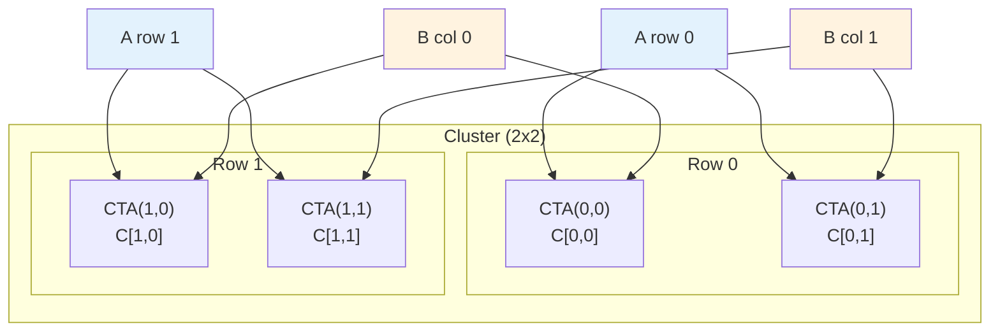
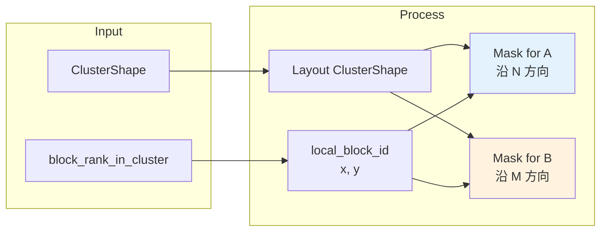
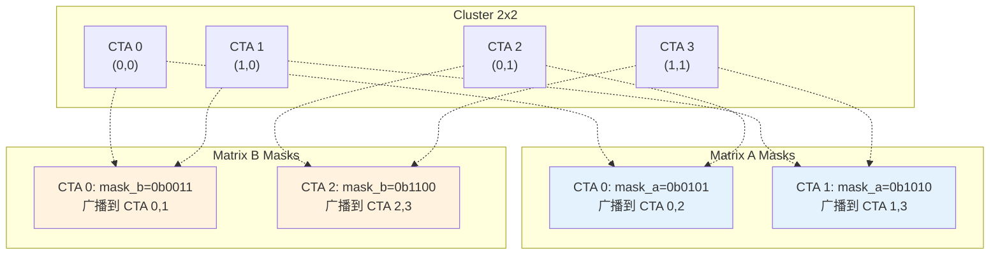
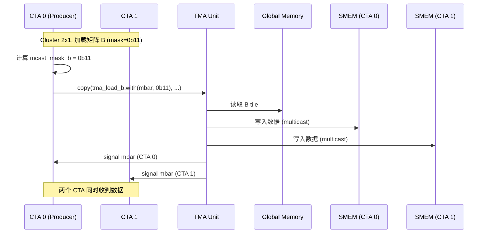
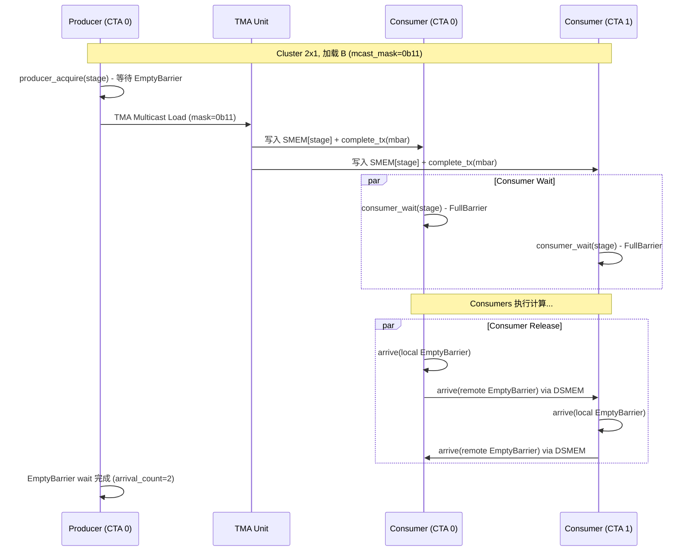

This article explains NVIDIA Hopper (SM90) TMA Multicast mechanism, including multicast mask calculation, Cluster-Multicast relationship, and practical GEMM applications.

<!-- more -->

> **核心要点速览**
> 1. **Multicast Mask**：16-bit，每位对应 Cluster 内一个 CTA
> 2. **A/B 广播方向**：A 沿 N 方向（同行），B 沿 M 方向（同列）
> 3. **EmptyBarrier arrival count**：`(cluster_x + cluster_y - 1) × warpgroups`
> 4. **Consumer release 跨 CTA**：使用 DSMEM + `mbarrier.arrive.shared::cluster`
> 5. **FullBarrier**：TMA 硬件自动对所有目标 CTA 的 mbarrier 调用 `complete_tx`

## 1. TMA Multicast 概述

### 1.1 什么是 TMA Multicast

TMA Multicast 是 Hopper 架构 TMA 的高级特性，允许**单次 TMA 操作将数据广播到 Cluster 内的多个 CTA（Thread Block）**。这对于 GEMM 等需要数据复用的场景非常有价值。

### 1.2 为什么需要 Multicast

在 GEMM 中，矩阵 A 和 B 的数据被多个输出 tile 共享：



- **矩阵 A**：同一行的 CTA 共享相同的 A tile（沿 N 方向广播）
- **矩阵 B**：同一列的 CTA 共享相同的 B tile（沿 M 方向广播）

### 1.3 CTA 数据共享关系

```
C[M, N] = A[M, K] x B[K, N]

2x2 Cluster CTA assignment:
              N direction
         N_tile_0    N_tile_1
        +-----------+-----------+
M_tile_0| CTA(0,0)  | CTA(0,1)  |  <- both need same A[M_tile_0]
        +-----------+-----------+
M_tile_1| CTA(1,0)  | CTA(1,1)  |  <- both need same A[M_tile_1]
        +-----------+-----------+
             ^           ^
          need same   need same
          B[N_tile_0] B[N_tile_1]
```

| Matrix | Sharing Rule | Example |
|--------|--------------|---------|
| A | same-row CTAs share | CTA(0,0), CTA(0,1) share A[M_tile_0] |
| B | same-col CTAs share | CTA(0,0), CTA(1,0) share B[N_tile_0] |

### 1.4 Multicast Loading Strategy

```
Matrix A (first column CTAs load):
+-------------------------------------------------------------+
|                                                             |
|  CTA(0,0) loads A[M_tile_0, K]                              |
|      |                                                      |
|      +--> multicast --> CTA(0,0), CTA(0,1) SMEM             |
|                                                             |
|  CTA(1,0) loads A[M_tile_1, K]                              |
|      |                                                      |
|      +--> multicast --> CTA(1,0), CTA(1,1) SMEM             |
|                                                             |
|  CTA(0,1), CTA(1,1): don't load A (receive from multicast)  |
|                                                             |
+-------------------------------------------------------------+

Matrix B (first row CTAs load):
+-------------------------------------------------------------+
|                                                             |
|  CTA(0,0) loads B[K, N_tile_0]                              |
|      |                                                      |
|      +--> multicast --> CTA(0,0), CTA(1,0) SMEM             |
|                                                             |
|  CTA(0,1) loads B[K, N_tile_1]                              |
|      |                                                      |
|      +--> multicast --> CTA(0,1), CTA(1,1) SMEM             |
|                                                             |
|  CTA(1,0), CTA(1,1): don't load B (receive from multicast)  |
|                                                             |
+-------------------------------------------------------------+
```

**每个 CTA 的工作量**：

| CTA | 加载 A | 加载 B | 说明 |
|-----|--------|--------|------|
| CTA(0,0) | ✓ | ✓ | 最忙，加载两份数据 |
| CTA(0,1) | ✗ | ✓ | 只加载 B |
| CTA(1,0) | ✓ | ✗ | 只加载 A |
| CTA(1,1) | ✗ | ✗ | 不加载，全部 multicast |

**带宽节省**：A 加载 2 次 (vs 4 次)，B 加载 2 次 (vs 4 次) → 节省 50%！

### 1.5 数据流向图示

```
                    Global Memory
                         |
          +--------------+---------------+
          |              |               |
          v              v               v
    A[M_tile_0]    A[M_tile_1]    B[N_tile_0]    B[N_tile_1]
          |              |               |              |
          |              |               |              |
     CTA(0,0)       CTA(1,0)        CTA(0,0)       CTA(0,1)
     load A0        load A1         load B0        load B1
          |              |               |              |
          |              |               |              |
    +-----+-----+  +-----+-----+   +-----+-----+  +-----+-----+
    |           |  |           |   |           |  |           |
    v           v  v           v   v           v  v           v
 CTA(0,0)   CTA(0,1) CTA(1,0) CTA(1,1) CTA(0,0) CTA(1,0) CTA(0,1) CTA(1,1)
  SMEM_A     SMEM_A   SMEM_A   SMEM_A   SMEM_B   SMEM_B   SMEM_B   SMEM_B
```

### 1.6 Multicast vs 独立加载

| 方式 | 带宽消耗 | 延迟 |
|-----|---------|------|
| 每个 CTA 独立加载 | N × 数据量 | 竞争 L2/HBM |
| Multicast | 1 × 数据量 | 一次加载，硬件广播 |

对于 2×2 Cluster，Multicast 可节省约 50% 的内存带宽。

---

## 2. Multicast Mask 原理

### 2.1 Mask 结构

Multicast mask 是一个 **16-bit 整数**，每一位对应 Cluster 内的一个 CTA：

```
Cluster 内 CTA 编号 (block_rank_in_cluster):

  Cluster 2x2 示例:
  +-------+-------+
  | CTA 0 | CTA 1 |  (row 0)
  +-------+-------+
  | CTA 2 | CTA 3 |  (row 1)
  +-------+-------+

  multicast_mask = 0b0011 表示广播到 CTA 0 和 CTA 1
  multicast_mask = 0b0101 表示广播到 CTA 0 和 CTA 2
```

### 2.2 CTA 编号计算

CTA 在 Cluster 内的编号由 `Layout<ClusterShape>` 决定：

```cpp
// 源码: include/cutlass/gemm/collective/sm90_mma_tma_gmma_ss_warpspecialized.hpp:331
constexpr uint32_t cluster_shape_x = get<0>(typename DispatchPolicy::ClusterShape());
uint2 cluster_local_block_id = {
    block_rank_in_cluster % cluster_shape_x,  // x = M 方向
    block_rank_in_cluster / cluster_shape_x   // y = N 方向
};
```

对于 `ClusterShape = Shape<_2, _2>`：
- `block_rank = 0` → `(x=0, y=0)`
- `block_rank = 1` → `(x=1, y=0)`
- `block_rank = 2` → `(x=0, y=1)`
- `block_rank = 3` → `(x=1, y=1)`

### 2.3 Mask 计算逻辑



---

## 3. Multicast Mask 实现详解

### 3.1 矩阵 A 的 Mask（沿 N 方向广播）

矩阵 A 的同一行数据被 N 方向的所有 CTA 共享：

```cpp
// 源码: include/cutlass/gemm/collective/sm90_mma_tma_gmma_ss_warpspecialized.hpp:357-362
uint16_t mcast_mask_a = 0;
auto block_layout = Layout<typename DispatchPolicy::ClusterShape>{};  // (m,n) -> block_id

// 固定 M 坐标（当前 CTA 的 x），遍历所有 N 坐标
for (int n = 0; n < size<1>(block_layout); ++n) {
    mcast_mask_a |= (uint16_t(1) << block_layout(cluster_local_block_id.x, n, Int<0>{}));
}
```

**示例**：ClusterShape = (2, 2)，当前 CTA 的 x = 0

| n | block_layout(0, n) | 累加 mask |
|---|-------------------|-----------|
| 0 | 0 | 0b0001 |
| 1 | 2 | 0b0101 |

最终 `mcast_mask_a = 0b0101`（广播到 CTA 0 和 CTA 2）

### 3.2 矩阵 B 的 Mask（沿 M 方向广播）

矩阵 B 的同一列数据被 M 方向的所有 CTA 共享：

```cpp
// 源码: include/cutlass/gemm/collective/sm90_mma_tma_gmma_ss_warpspecialized.hpp:364-368
uint16_t mcast_mask_b = 0;
auto block_layout = Layout<typename DispatchPolicy::ClusterShape>{};

// 固定 N 坐标（当前 CTA 的 y），遍历所有 M 坐标
for (int m = 0; m < size<0>(block_layout); ++m) {
    mcast_mask_b |= (uint16_t(1) << block_layout(m, cluster_local_block_id.y, Int<0>{}));
}
```

**示例**：ClusterShape = (2, 2)，当前 CTA 的 y = 0

| m | block_layout(m, 0) | 累加 mask |
|---|-------------------|-----------|
| 0 | 0 | 0b0001 |
| 1 | 1 | 0b0011 |

最终 `mcast_mask_b = 0b0011`（广播到 CTA 0 和 CTA 1）

### 3.3 完整 Mask 计算图示



---

## 4. create_tma_multicast_mask 函数

### 4.1 通用版本

CuTe 提供了通用的 multicast mask 创建函数：

```cpp
// 源码: include/cute/atom/copy_traits_sm90_tma.hpp:1439-1469
template <class CTA_Layout, class CTA_Coord>
CUTE_HOST_DEVICE constexpr
uint16_t
create_tma_multicast_mask(CTA_Layout const& cta_layout,    // Cluster 布局
                          CTA_Coord  const& cta_coord)     // 当前 CTA 坐标
{
    // 将坐标分解为参与 multicast 的部分和不参与的部分
    auto [rest_coord, mcast_coord] = slice_and_offset(cta_coord, cta_layout);

    // 获取 multicast 相关的子布局
    auto mcast_layout = cta_layout.slice(rest_coord);

    uint16_t mcast_mask = 0;

    // 优化路径：rank-1 且深度 <= 1
    if constexpr (rank(mcast_layout) == 1 && depth(mcast_layout) <= 1) {
        // 位 smearing 技术
        mcast_mask = uint16_t(1) << mcast_coord;
        mcast_mask |= mcast_mask << (1 * stride<0>(mcast_layout));
        mcast_mask |= mcast_mask << (2 * stride<0>(mcast_layout));
        mcast_mask |= mcast_mask << (4 * stride<0>(mcast_layout));
        mcast_mask |= mcast_mask << (8 * stride<0>(mcast_layout));
    }
    else {
        // 通用路径：遍历所有位置
        for (int i = 0; i < size(mcast_layout); ++i) {
            mcast_mask |= (uint16_t(1) << mcast_layout(i));
        }
    }

    return mcast_mask;
}
```

### 4.2 带 Mode 参数的版本

用于指定沿哪个维度进行 multicast：

```cpp
// 源码: include/cute/atom/copy_traits_sm90_tma.hpp:1475-1479
template <int... Mode, class CTA_Layout, class CTA_Coord>
CUTE_HOST_DEVICE constexpr
uint16_t
create_tma_multicast_mask(CTA_Layout const& cta_layout,
                          CTA_Coord  const& cta_coord)
{
    // 只保留指定 Mode 的坐标，其他设为 0
    auto proj_coord = cute::make_tuple(
        cute::conditional_return<cute::is_one_of<Int<Mode>...>::template eval<Int<I>>()>(
            get<I>(cta_coord), Int<0>{})...
    );
    return create_tma_multicast_mask(cta_layout, proj_coord);
}
```

**使用示例**：

```cpp
// 源码: include/cutlass/gemm/collective/sm90_sparse_mma_tma_gmma_ss_warpspecialized.hpp:425-431
Layout cta_layout_mnk = make_layout(ClusterShape{});
auto cta_coord_mnk = cta_layout_mnk.get_flat_coord(block_rank_in_cluster);

// Mode<1> = N 方向，用于矩阵 A
uint16_t mcast_mask_a = create_tma_multicast_mask<1>(cta_layout_mnk, cta_coord_mnk);

// Mode<0> = M 方向，用于矩阵 B
uint16_t mcast_mask_b = create_tma_multicast_mask<0>(cta_layout_mnk, cta_coord_mnk);
```

---

## 5. TMA Multicast 指令

### 5.1 PTX 指令格式

```asm
cp.async.bulk.tensor.{dim}d.shared::cluster.global.mbarrier::complete_tx::bytes.multicast::cluster.L2::cache_hint
    [smem_ptr], [tma_desc, {coords}], [mbar_ptr], multicast_mask, cache_hint;
```

关键修饰符：
- `.multicast::cluster`：启用 cluster 内 multicast
- `multicast_mask`：16-bit 掩码，指示目标 CTA

### 5.2 实现代码

```cpp
// 源码: include/cute/arch/copy_sm90_tma.hpp:626-652
struct SM90_TMA_LOAD_MULTICAST_1D
{
  CUTE_HOST_DEVICE static void
  copy(void const* desc_ptr,
       uint64_t* mbar_ptr,
       uint16_t multicast_mask,     // <-- multicast 掩码
       uint64_t cache_hint,
       void* smem_ptr,
       int32_t const& crd0)
  {
#if defined(CUTE_ARCH_TMA_SM90_ENABLED)
    uint64_t gmem_int_desc = reinterpret_cast<uint64_t>(desc_ptr);
    uint32_t smem_int_mbar = cast_smem_ptr_to_uint(mbar_ptr);
    uint32_t smem_int_ptr  = cast_smem_ptr_to_uint(smem_ptr);

    asm volatile (
      "cp.async.bulk.tensor.1d.shared::cluster.global.mbarrier::complete_tx::bytes.multicast::cluster.L2::cache_hint"
      " [%0], [%1, {%4}], [%2], %3, %5;"
      :
      : "r"(smem_int_ptr),     // 目标 SMEM 地址
        "l"(gmem_int_desc),    // TMA Descriptor
        "r"(smem_int_mbar),    // mbarrier 地址
        "h"(multicast_mask),   // 16-bit multicast 掩码
        "r"(crd0),             // 坐标
        "l"(cache_hint)        // L2 缓存提示
      : "memory");
#endif
  }
};
```

### 5.3 Copy_Traits 集成

```cpp
// 源码: include/cute/atom/copy_traits_sm90_tma.hpp:278-296
// .with() 方法绑定运行时参数
CUTE_HOST_DEVICE constexpr
Copy_Traits<SM90_TMA_LOAD_MULTICAST_OP, NumBitsPerTMA>
with(uint64_t& tma_load_mbar,
     uint16_t const& multicast_mask,
     TMA::CacheHintSm90 const& cache_hint = TMA::CacheHintSm90::EVICT_NORMAL) const
{
    return {
        &tma_desc_,
        &tma_load_mbar,
        multicast_mask,
        static_cast<uint64_t>(cache_hint)
    };
}
```

---

## 6. 在 GEMM Collective 中的应用

### 6.1 Warp-Specialized Mainloop

```cpp
// 源码: include/cutlass/gemm/collective/sm90_mma_tma_gmma_ss_warpspecialized.hpp:310-390

template <class... Args>
CUTLASS_DEVICE void
load(Params const& mainloop_params,
     MainloopPipeline pipeline,
     PipelineState smem_pipe_write,
     cute::tuple<Args...> const& load_inputs,
     BlockCoord const& blk_coord,
     KTileIterator k_tile_iter, int k_tile_count,
     int lane_idx,
     uint32_t block_rank_in_cluster,
     SharedStorage& shared_storage)
{
    // 步骤 1: 计算本地 CTA 坐标
    constexpr uint32_t cluster_shape_x = get<0>(ClusterShape{});
    uint2 cluster_local_block_id = {
        block_rank_in_cluster % cluster_shape_x,
        block_rank_in_cluster / cluster_shape_x
    };

    // 步骤 2: 根据 CTA 坐标分区 TMA descriptor
    auto [tAgA, tAsA] = tma_partition_A(cluster_local_block_id.y);
    auto [tBgB, tBsB] = tma_partition_B(cluster_local_block_id.x);

    // 步骤 3: 计算 multicast mask
    uint16_t mcast_mask_a = 0;
    uint16_t mcast_mask_b = 0;

    auto block_layout = Layout<ClusterShape>{};

    // A: 沿 N 方向广播（固定 M，遍历 N）
    CUTLASS_PRAGMA_UNROLL
    for (int n = 0; n < size<1>(block_layout); ++n) {
        mcast_mask_a |= (uint16_t(1) << block_layout(cluster_local_block_id.x, n, Int<0>{}));
    }

    // B: 沿 M 方向广播（固定 N，遍历 M）
    CUTLASS_PRAGMA_UNROLL
    for (int m = 0; m < size<0>(block_layout); ++m) {
        mcast_mask_b |= (uint16_t(1) << block_layout(m, cluster_local_block_id.y, Int<0>{}));
    }

    // 步骤 4: Mainloop - TMA Load with Multicast
    CUTLASS_PRAGMA_NO_UNROLL
    for ( ; k_tile_count > 0; --k_tile_count) {
        // 获取 pipeline stage
        pipeline.producer_acquire(smem_pipe_write);

        BarrierType* tma_barrier = pipeline.producer_get_barrier(smem_pipe_write);
        int write_stage = smem_pipe_write.index();

        // 发起 TMA Multicast Load
        copy(mainloop_params.tma_load_a.with(*tma_barrier, mcast_mask_a),
             tAgA(_,_,_,*k_tile_iter),
             tAsA(_,_,_,write_stage));

        copy(mainloop_params.tma_load_b.with(*tma_barrier, mcast_mask_b),
             tBgB(_,_,_,*k_tile_iter),
             tBsB(_,_,_,write_stage));

        ++k_tile_iter;
        ++smem_pipe_write;
    }
}
```

### 6.2 执行流程时序图



---

## 7. Multicast 性能优化

### 7.1 最佳实践

1. **选择合适的 Cluster Shape**
   - 太小：multicast 收益有限
   - 太大：受限于 SM 资源，可能降低 occupancy

2. **对齐数据**
   - TMA 要求 16 字节对齐
   - Multicast 不会改变对齐要求

3. **平衡 A 和 B 的 multicast**
   - ClusterShape = (M, N)
   - A multicast 因子 = N
   - B multicast 因子 = M

### 7.2 Cluster Shape 选择指南

| Cluster Shape | A Multicast | B Multicast | 总带宽节省 |
|---------------|-------------|-------------|-----------|
| (1, 1) | 1x | 1x | 0% |
| (2, 1) | 1x | 2x | ~25% |
| (1, 2) | 2x | 1x | ~25% |
| (2, 2) | 2x | 2x | ~50% |
| (4, 1) | 1x | 4x | ~37.5% |
| (2, 4) | 4x | 2x | ~62.5% |

### 7.3 限制条件

- Cluster 最大支持 16 个 CTA（由 16-bit mask 限制）
- Multicast 只在同一 Cluster 内有效
- 所有目标 CTA 的 SMEM 布局必须相同

---

## 8. TMA Multicast 与 mbarrier 特殊处理

TMA Multicast 场景下，mbarrier 的初始化和同步需要特殊处理，以确保跨 CTA 的正确协调。

### 8.1 EmptyBarrier Arrival Count 的计算

在 Cluster 模式下，EmptyBarrier 的 arrival count 需要考虑数据共享关系：

```cpp
// 源码: include/cutlass/pipeline/sm90_pipeline.hpp:311-321
uint32_t const num_consumer_warpgroups_per_cluster =
    cute::ceil_div(params.num_consumers, static_cast<uint32_t>(NumThreadsPerWarpGroup));

uint32_t multicast_consumer_arrival_count = params.num_consumers; // Cluster size = 1

if (cute::size(cluster_shape) > 1) {
    // 关键公式：需要信号的 CTA 数量 = (cluster_x + cluster_y - 1)
    multicast_consumer_arrival_count =
        (cute::size<0>(cluster_shape) + cute::size<1>(cluster_shape) - 1) *
        num_consumer_warpgroups_per_cluster;
}
```

**为什么是 `(cluster_x + cluster_y - 1)`？**

以 2×2 Cluster 为例，考虑 CTA(0,0) 的 EmptyBarrier：
- CTA(0,0) 自己使用该 buffer
- CTA(0,1) 共享 A 数据（同行）
- CTA(1,0) 共享 B 数据（同列）
- CTA(1,1) 不与 CTA(0,0) 共享任何数据

因此 arrival count = (2 + 2 - 1) = 3 个 CTA 需要对该 barrier arrive。

```
Cluster 2x2 中 CTA(0,0) 的数据共享关系:

        Col 0       Col 1
       +-------+-------+
Row 0  | (0,0) | (0,1) |  ← 共享 A (同行)
       +-------+-------+
Row 1  | (1,0) | (1,1) |
       +-------+-------+
           ↑
       共享 B (同列)

需要 arrive 的 CTA: (0,0), (0,1), (1,0) → 共 3 个
```

### 8.2 is_same_row_or_col：确定信号目标

每个 Consumer 线程需要对远程 CTA 的 barrier 进行 arrive，但只针对**共享数据的 CTA**：

```cpp
// 源码: include/cutlass/pipeline/sm90_pipeline.hpp:392-397
template <class ClusterShape>
CUTLASS_DEVICE
bool is_same_row_or_col(int dst_block_id, dim3 block_id, ClusterShape cluster_shape) {
    return (((dst_block_id % cute::size<0>(cluster_shape)) == block_id.x) ||  // 同列
            ((dst_block_id / cute::size<0>(cluster_shape)) == block_id.y));   // 同行
}
```

这确保了：
- 同一行的 CTA 互相 arrive（因为共享 A 数据）
- 同一列的 CTA 互相 arrive（因为共享 B 数据）

### 8.3 Consumer Release：跨 CTA 的 barrier arrive

`consumer_release` 使用 DSMEM 机制对远程 CTA 的 barrier 进行 arrive。

> **详细实现**：参见 [Pipeline 与 mbarrier 深度解析 - DSMEM 跨 CTA 同步](/2024/12/23/pipeline-barrier-ptx-mapping/#1-6-Cluster-级别的-mbarrier-同步与-DSMEM)

核心要点：
- 使用 `mapa` 指令映射远程 SMEM 地址
- `mbarrier.arrive.shared::cluster` 执行跨 SM arrive
- `is_same_row_or_col` 函数确定需要 arrive 的目标 CTA

**Consumer Release 初始化**：

```cpp
// 构造函数中设置
auto [is_signaling_thread, dst_blockid] =
    spread_arrivals_to_warpgroup(thread_idx % NumThreadsPerWarpGroup, warp_idx);

is_signaling_thread_ &= is_same_row_or_col(dst_blockid_, block_id, cluster_shape);

// 运行时 arrive
void consumer_release(stage) {
    empty_barrier.arrive(dst_blockid_, is_signaling_thread_);
}
```

**spread_arrivals_to_warpgroup 实现**：

```cpp
cute::tuple<bool, uint32_t> spread_arrivals_to_warpgroup(
    int thread_idx_in_warpgroup, int warp_idx)
{
    // 每 8 个线程选一个 signaling thread
    // 128 threads / 16 CTA = 8
    bool is_signaling_thread = (thread_idx_in_warpgroup % 8) == 0;

    // 用 Swizzle Layout 分配 dst_blockid (0-15)
    auto layout = cute::composition(Swizzle<2,0,-2>{},
                                    Layout<Shape<_4,_4>,Stride<_4,_1>>{});
    uint32_t thread_row = warp_idx % 4;
    uint32_t thread_col = (thread_idx_in_warpgroup / 8) % 4;
    uint32_t dst_blockid = layout(thread_row, thread_col);

    return cute::make_tuple(is_signaling_thread, dst_blockid);
}
```

**2×2 Cluster Arrive 流程示例**：

```
CTA(0,0) Consumer Warpgroup executes consumer_release():

                    16 signaling threads in Warpgroup
                              |
              +---------------+---------------+
              |               |               |
              v               v               v
         CTA(0,0)        CTA(0,1)        CTA(1,0)         CTA(1,1)
         barrier         barrier         barrier          barrier
            ^               ^               ^                X
            |               |               |           (not same row/col)
         arrive          arrive          arrive

    is_same_row_or_col:  Y (self)    Y (same row)   Y (same col)    N

Each warpgroup sends 1 arrive to 3 valid CTAs
2 warpgroups -> each valid CTA receives 2 arrives
3 valid CTAs x 2 warpgroups = 6 total arrives
```

**远程 Barrier Arrive PTX**：

```cpp
static void arrive(ValueType const* smem_ptr, uint32_t cta_id, uint32_t pred) {
    uint32_t smem_addr = cute::cast_smem_ptr_to_uint(smem_ptr);
    if (pred) {
        asm volatile(
            "{\n\t"
            ".reg .b32 remAddr32;\n\t"
            "mapa.shared::cluster.u32  remAddr32, %0, %1;\n\t"  // 映射远程地址
            "mbarrier.arrive.shared::cluster.b64  _, [remAddr32];\n\t"
            "}"
            :
            : "r"(smem_addr), "r"(cta_id));
    }
}
```

关键指令：
- `mapa.shared::cluster`: 本地 SMEM 地址 → 远程 CTA SMEM 地址
- `mbarrier.arrive.shared::cluster`: 对远程 barrier 执行 arrive

### 8.4 TMA Multicast 与 FullBarrier

TMA Multicast 指令自动处理 FullBarrier。Producer 只需发起一次 TMA 调用，硬件会：
- 广播数据到 multicast_mask 指定的所有 CTA
- 对每个目标 CTA 的 mbarrier 调用 `complete_tx`

> **expect_tx/complete_tx 详解**：参见 [TMA Descriptor 深度解析 - Transaction Barrier](/2024/12/24/tma-descriptor-deep-dive/#6-TMA-Transaction-Barrier-与-expect-tx-机制)

### 8.5 完整的 Pipeline 同步流程



### 8.6 TMA Multicast vs 普通 TMA 对比

| 维度 | 普通 TMA | TMA Multicast |
|-----|---------|---------------|
| **数据目标** | 单 CTA | Cluster 内多 CTA |
| **内存带宽** | N × 数据量 | 1 × 数据量 |
| **Multicast Mask** | 不需要 | 16-bit |
| **EmptyBarrier arrival** | `num_consumers` | `(cluster_x + cluster_y - 1) × warpgroups` |
| **Consumer release** | 本地 arrive | 本地 + 远程 arrive |
| **TMA 调用** | `tma.with(*mbar)` | `tma.with(*mbar, mask)` |

> **A/B 共享 Barrier 详解**：参见 [TMA Descriptor - A 和 B 共享同一个 Barrier](/2024/12/24/tma-descriptor-deep-dive/#6-7-A-和-B-共享同一个-Barrier：累加机制)

---

## 9. 关键要点

1. **Multicast Mask 是 16-bit**：每位对应 cluster 内一个 CTA

2. **Layout 决定编号**：`Layout<ClusterShape>` 将 (m,n) 映射到线性 block_id

3. **A/B 不同方向**：A 沿 N 方向广播，B 沿 M 方向广播

4. **由 Producer 发起**：只需一个 CTA 发起 TMA，硬件负责广播

5. **EmptyBarrier arrival count**：`(cluster_x + cluster_y - 1) × warpgroups`

6. **Consumer Release 跨 CTA**：通过 DSMEM 实现

## 10. 相关文档

- [Pipeline 与 mbarrier 深度解析](/2024/12/23/pipeline-barrier-ptx-mapping/) - DSMEM、mbarrier PTX
- [TMA Descriptor 深度解析](/2024/12/24/tma-descriptor-deep-dive/) - expect_tx/complete_tx、A/B 共享 Barrier

---

## 参考资料

- [CUTLASS GitHub 仓库](https://github.com/NVIDIA/cutlass)
- [sm90_mma_tma_gmma_ss_warpspecialized.hpp](https://github.com/NVIDIA/cutlass/blob/main/include/cutlass/gemm/collective/sm90_mma_tma_gmma_ss_warpspecialized.hpp)
- [copy_traits_sm90_tma.hpp](https://github.com/NVIDIA/cutlass/blob/main/include/cute/atom/copy_traits_sm90_tma.hpp)
- [copy_sm90_tma.hpp](https://github.com/NVIDIA/cutlass/blob/main/include/cute/arch/copy_sm90_tma.hpp)
- [sm90_pipeline.hpp](https://github.com/NVIDIA/cutlass/blob/main/include/cutlass/pipeline/sm90_pipeline.hpp) - Pipeline 和 mbarrier 处理
- [barrier.h](https://github.com/NVIDIA/cutlass/blob/main/include/cutlass/arch/barrier.h) - ClusterBarrier 实现
- [NVIDIA PTX ISA - TMA Multicast](https://docs.nvidia.com/cuda/parallel-thread-execution/index.html#data-movement-and-conversion-instructions-cp-async-bulk-tensor)
- [NVIDIA PTX ISA - mbarrier](https://docs.nvidia.com/cuda/parallel-thread-execution/index.html#parallel-synchronization-and-communication-instructions-mbarrier)
