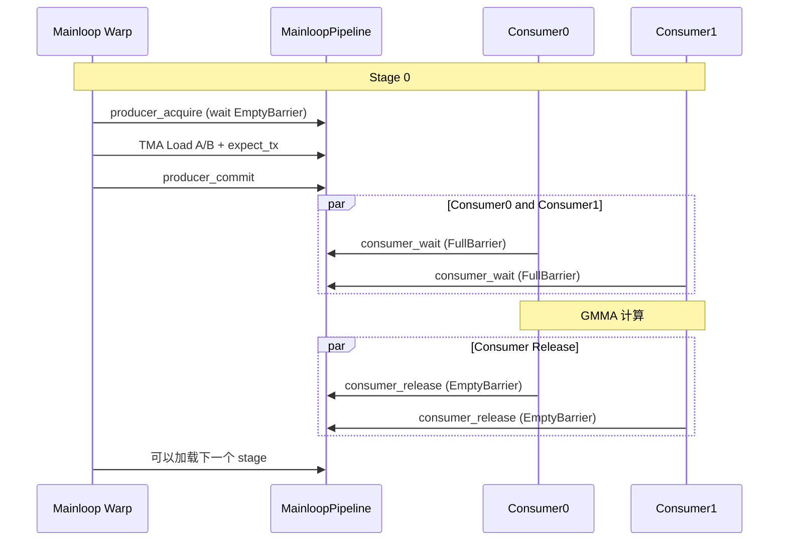
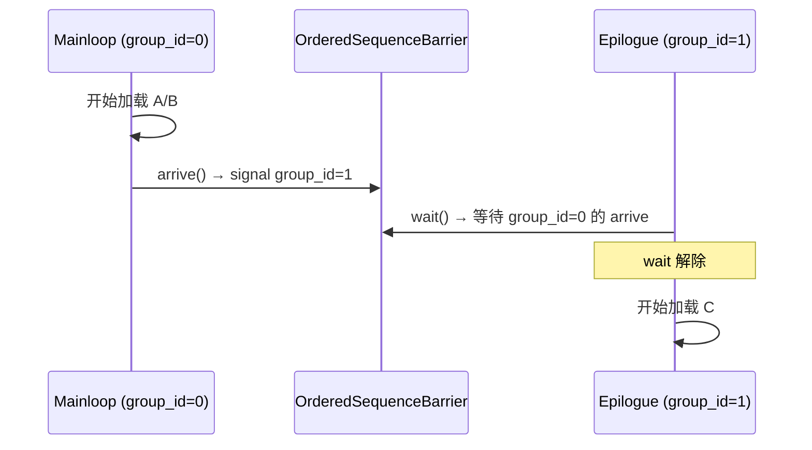
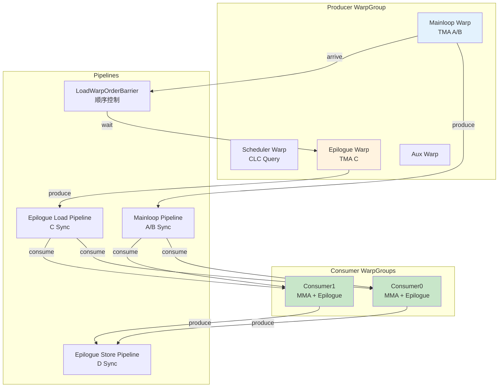

本文深入解析 CUTLASS SM90 Cooperative Kernel 中的多种 Pipeline 机制，包括 Mainloop Pipeline、Epilogue Load/Store Pipeline、TileScheduler Pipeline 以及 LoadWarpOrderBarrier。

<!-- more -->

> **核心要点速览**
> 1. **Warp 分工**：Producer WarpGroup 分为 Mainloop/Epilogue/Scheduler/Aux 四个角色
> 2. **Mainloop Pipeline**：`PipelineTmaAsync`，Producer TMA 加载，Consumer MMA 计算
> 3. **Epilogue Load/Store Pipeline**：独立的加载和存储同步
> 4. **LoadWarpOrderBarrier**：确保 Mainloop 先于 Epilogue 执行
> 5. **无 cluster_sync**：使用 `cluster_arrive_relaxed` + 延迟 `cluster_wait`
>
> **前置知识**：[Pipeline 与 mbarrier 深度解析](/2024/12/23/pipeline-barrier-ptx-mapping/)、[TMA Descriptor 深度解析](/2024/12/24/tma-descriptor-deep-dive/)

## 1. Warp Specialization 架构

### 1.1 线程组织

Cooperative Kernel 使用 **Warp Specialization** 技术，将线程分为不同角色：

```
Thread Block (384 threads = 12 warps = 3 warp groups)
├── WarpGroup 0: Producer (128 threads = 4 warps)
│   ├── Warp 0: Mainloop Producer (TMA Load A/B)
│   ├── Warp 1: Scheduler Producer (CLC Query)
│   ├── Warp 2: Epilogue Producer (TMA Load C)
│   └── Warp 3: MainloopAux Producer (辅助加载)
│
├── WarpGroup 1: Consumer0 (128 threads = 4 warps)
│   └── 执行 MMA 计算 + Epilogue Store
│
└── WarpGroup 2: Consumer1 (128 threads = 4 warps)
    └── 与 Consumer0 协作执行同一 tile
```

### 1.2 角色定义

```cpp
// 源码: sm90_gemm_tma_warpspecialized_cooperative.hpp:366-376
enum class WarpGroupRole {
  Producer = 0,
  Consumer0 = 1,
  Consumer1 = 2
};

enum class ProducerWarpRole {
  Mainloop = 0,     // Warp 0: TMA Load A/B
  Warp1 = 1,        // Warp 1: Scheduler (CLC query)
  Epilogue = 2,     // Warp 2: TMA Load C
  MainloopAux = 3   // Warp 3: 辅助加载（可选）
};
```

### 1.3 寄存器动态分配

```cpp
// Producer: 低寄存器需求
cutlass::arch::warpgroup_reg_dealloc<LoadRegisterRequirement>();  // 24-40 regs

// Consumer: 高寄存器需求（累加器）
cutlass::arch::warpgroup_reg_alloc<MmaRegisterRequirement>();     // 232-240 regs
```

---

## 2. Pipeline 类型总览

Cooperative Kernel 中使用了 **5 种 Pipeline**：

| Pipeline | 类型 | Producer | Consumer | 用途 |
|----------|------|----------|----------|------|
| **Mainloop Pipeline** | `PipelineTmaAsync` | Mainloop Warp | Consumer0/1 | A/B tile 加载 |
| **Epilogue Load Pipeline** | `PipelineTransactionAsync` | Epilogue Warp | Consumer0/1 | C 矩阵加载 |
| **Epilogue Store Pipeline** | `PipelineTmaStore` | Consumer0/1 | TMA Unit | D 矩阵写回 |
| **Scheduler Pipeline** | `PipelineAsync` | Scheduler Warp | All Warps | Tile 调度 |
| **LoadWarpOrderBarrier** | `OrderedSequenceBarrier` | Mainloop Warp | Epilogue Warp | 加载顺序 |

### 2.1 Pipeline 存储结构

```cpp
// 源码: sm90_gemm_tma_warpspecialized_cooperative.hpp:148-157
struct SharedStorage {
  struct PipelineStorage : cute::aligned_struct<16, _1> {
    MainloopPipelineStorage mainloop;      // Mainloop barriers
    EpiLoadPipelineStorage epi_load;       // Epilogue load barriers
    typename LoadWarpOrderBarrier::SharedStorage load_order;  // 顺序控制
  } pipelines;

  TileSchedulerStorage scheduler;          // Scheduler barriers
  TensorStorage tensors;                   // SMEM 数据缓冲区
};
```

---

## 3. Mainloop Pipeline

### 3.1 初始化

```cpp
// 源码: sm90_gemm_tma_warpspecialized_cooperative.hpp:444-458
using MainloopPipeline = typename CollectiveMainloop::MainloopPipeline;
typename MainloopPipeline::Params mainloop_pipeline_params;

// Producer: Mainloop Warp 或 MainloopAux Warp
if (warp_group_role == WarpGroupRole::Producer &&
    (producer_warp_role == ProducerWarpRole::Mainloop ||
     producer_warp_role == ProducerWarpRole::MainloopAux)) {
  mainloop_pipeline_params.role = MainloopPipeline::ThreadCategory::Producer;
}

// Consumer: Consumer0 和 Consumer1
if (warp_group_role == WarpGroupRole::Consumer0 ||
    warp_group_role == WarpGroupRole::Consumer1) {
  mainloop_pipeline_params.role = MainloopPipeline::ThreadCategory::Consumer;
}

mainloop_pipeline_params.is_leader = warp_group_thread_idx == 0;
mainloop_pipeline_params.num_consumers = NumMMAThreads;         // 256
mainloop_pipeline_params.num_producers = NumProducerThreads;    // 32 或 64
mainloop_pipeline_params.transaction_bytes = params.mainloop.tma_transaction_bytes;

MainloopPipeline mainloop_pipeline(shared_storage.pipelines.mainloop,
                                   mainloop_pipeline_params, ClusterShape{});
```

### 3.2 Producer 端（Mainloop Warp）

```cpp
// 源码: sm90_gemm_tma_warpspecialized_cooperative.hpp:585-650
if (producer_warp_role == ProducerWarpRole::Mainloop) {
  while (work_tile_info.is_valid()) {
    // 调用 CollectiveMainloop::load()
    collective_mainloop.load(
      params.mainloop,
      mainloop_pipeline,           // Pipeline 接口
      mainloop_pipe_producer_state, // 当前 stage
      load_inputs,                 // A/B tensors
      blk_coord,
      k_tile_iter, work_k_tile_count,
      lane_idx,
      block_rank_in_cluster,
      shared_storage.tensors.mainloop
    );

    mainloop_pipe_producer_state.advance(work_k_tile_count);

    // 通知 Epilogue Warp 可以开始
    if (do_load_order_arrive) {
      load_order_barrier.arrive();
      do_load_order_arrive = false;
    }

    // 获取下一个 tile
    work_tile_info = scheduler.fetch_next_work(...);
  }

  // 通知所有 Consumer 结束
  collective_mainloop.load_tail(mainloop_pipeline, mainloop_pipe_producer_state);
}
```

### 3.3 Consumer 端（CollectiveMma::mma）

Consumer 在 `CollectiveMainloop::mma()` 中使用 pipeline：

```cpp
// 源码: sm90_mma_tma_gmma_ss_warpspecialized.hpp:470-577
void mma(MainloopPipeline pipeline, PipelineState smem_pipe_read,
         Tensor& accum, int k_tile_count, ...) {

  PipelineState smem_pipe_release = smem_pipe_read;

  // Prologue: 预取前几个 tile
  for (int k = 0; k < prologue_mma_count; ++k) {
    auto barrier_token = pipeline.consumer_try_wait(smem_pipe_read);
    pipeline.consumer_wait(smem_pipe_read, barrier_token);

    // 执行 GMMA
    cute::gemm(tiled_mma, tCrA[read_stage], tCrB[read_stage], accum);
    ++smem_pipe_read;
  }

  // Main loop: 边计算边释放
  for (; k_tile_count > 0; --k_tile_count) {
    auto barrier_token = pipeline.consumer_try_wait(smem_pipe_read);
    pipeline.consumer_wait(smem_pipe_read, barrier_token);

    cute::gemm(tiled_mma, tCrA[read_stage], tCrB[read_stage], accum);

    warpgroup_wait<K_PIPE_MMAS>();  // 等待前几个 MMA 完成

    // 释放已计算完的 buffer
    pipeline.consumer_release(smem_pipe_release);

    ++smem_pipe_read;
    ++smem_pipe_release;
  }
}

// mma_tail: 释放剩余 buffer
void mma_tail(MainloopPipeline pipeline, PipelineState smem_pipe_release, int k_tile_count) {
  warpgroup_wait<0>();  // 等待所有 MMA 完成

  for (int count = 0; count < prologue_mma_count; ++count) {
    pipeline.consumer_release(smem_pipe_release);
    ++smem_pipe_release;
  }
}
```

### 3.4 同步流程图



---

## 4. Epilogue Load Pipeline

### 4.1 特点

- **类型**：`PipelineTransactionAsync`（与 Mainloop 相同）
- **Producer**：Epilogue Warp（Warp 2）
- **Consumer**：Consumer0 和 Consumer1
- **用途**：加载 C 矩阵用于 beta*C + alpha*A*B 融合

### 4.2 初始化

```cpp
// 源码: sm90_gemm_tma_warpspecialized_cooperative.hpp:460-475
using EpiLoadPipeline = typename CollectiveEpilogue::LoadPipeline;
typename EpiLoadPipeline::Params epi_load_pipeline_params;

if (warp_group_role == WarpGroupRole::Producer &&
    producer_warp_role == ProducerWarpRole::Epilogue) {
  epi_load_pipeline_params.role = EpiLoadPipeline::ThreadCategory::Producer;
}
if (warp_group_role == WarpGroupRole::Consumer0 ||
    warp_group_role == WarpGroupRole::Consumer1) {
  epi_load_pipeline_params.role = EpiLoadPipeline::ThreadCategory::Consumer;
}

epi_load_pipeline_params.dst_blockid = cute::block_rank_in_cluster();
epi_load_pipeline_params.producer_arv_count = NumEpilogueLoadThreads;  // 32
epi_load_pipeline_params.consumer_arv_count = NumMMAThreads;           // 256
epi_load_pipeline_params.transaction_bytes = params.epilogue.tma_transaction_bytes;

EpiLoadPipeline epi_load_pipeline(shared_storage.pipelines.epi_load, epi_load_pipeline_params);
```

### 4.3 Epilogue Producer

```cpp
// 源码: sm90_gemm_tma_warpspecialized_cooperative.hpp:700-750
if (producer_warp_role == ProducerWarpRole::Epilogue && is_epi_load_needed) {
  // 等待 Mainloop 先开始
  if (work_tile_info.is_valid()) {
    load_order_barrier.wait();
  }

  while (work_tile_info.is_valid()) {
    if (TileScheduler::compute_epilogue(work_tile_info, params.scheduler)) {
      epi_load_pipe_producer_state = collective_epilogue.load(
        epi_load_pipeline,
        epi_load_pipe_producer_state,
        problem_shape_MNKL,
        blk_coord,
        ...
      );
    }
    work_tile_info = scheduler.fetch_next_work(...);
  }

  collective_epilogue.load_tail(epi_load_pipeline, epi_load_pipe_producer_state);
}
```

---

## 5. Epilogue Store Pipeline

### 5.1 特点

- **类型**：`PipelineTmaStore`
- **无 mbarrier**：使用 TMA scoreboarding 机制
- **同步方式**：`tma_store_arrive()` + `tma_store_wait<N>()`

### 5.2 初始化

```cpp
// 源码: sm90_gemm_tma_warpspecialized_cooperative.hpp:477-481
using EpiStorePipeline = typename CollectiveEpilogue::StorePipeline;
typename EpiStorePipeline::Params epi_store_pipeline_params;
epi_store_pipeline_params.always_wait = true;  // 始终等待
EpiStorePipeline epi_store_pipeline(epi_store_pipeline_params);
```

### 5.3 使用（Consumer 端）

```cpp
// 源码: sm90_gemm_tma_warpspecialized_cooperative.hpp:810-830
if (TileScheduler::compute_epilogue(work_tile_info, params.scheduler)) {
  auto [epi_load_pipe_consumer_state_next, epi_store_pipe_producer_state_next] =
  collective_epilogue.store(
    epi_load_pipeline,
    epi_load_pipe_consumer_state,
    epi_store_pipeline,              // Store pipeline
    epi_store_pipe_producer_state,
    problem_shape_MNKL,
    blk_shape,
    blk_coord,
    accumulators,
    ...
  );

  epi_load_pipe_consumer_state = epi_load_pipe_consumer_state_next;
  epi_store_pipe_producer_state = epi_store_pipe_producer_state_next;
}

// 结束时
collective_epilogue.store_tail(
  epi_load_pipeline, epi_load_pipe_consumer_state,
  epi_store_pipeline, epi_store_pipe_producer_state
);
```

### 5.4 Store Pipeline 内部实现

```cpp
// PipelineTmaStore 使用 TMA scoreboarding 而非 mbarrier
// tma_store_arrive(): 提交一组 TMA store
// tma_store_wait<N>(): 等待直到最多 N 组未完成
```

---

## 6. LoadWarpOrderBarrier

### 6.1 目的

确保 **Mainloop Producer 先于 Epilogue Producer 执行**，避免 Epilogue 加载 C 矩阵时 Mainloop 还未开始。

### 6.2 定义

```cpp
// 源码: sm90_gemm_tma_warpspecialized_cooperative.hpp:140
using LoadWarpOrderBarrier = cutlass::OrderedSequenceBarrier<1, 2>;
// SequenceDepth = 1: 只有 1 个 stage
// SequenceLength = 2: 2 个参与者（Mainloop 和 Epilogue）
```

### 6.3 初始化

```cpp
// 源码: sm90_gemm_tma_warpspecialized_cooperative.hpp:483-486
typename LoadWarpOrderBarrier::Params params_load_order_barrier;
params_load_order_barrier.group_id = producer_warp_role == ProducerWarpRole::Mainloop ? 0 : 1;
params_load_order_barrier.group_size = NumThreadsPerWarp;  // 32

LoadWarpOrderBarrier load_order_barrier(shared_storage.pipelines.load_order,
                                        params_load_order_barrier);
```

### 6.4 使用

```cpp
// Mainloop Producer: 完成第一次加载后 arrive
if (do_load_order_arrive) {
  load_order_barrier.arrive();
  do_load_order_arrive = false;
}

// Epilogue Producer: 等待 Mainloop 先开始
if (work_tile_info.is_valid()) {
  load_order_barrier.wait();
}
```

### 6.5 工作原理



---

## 7. TileScheduler Pipeline

### 7.1 Dynamic Persistent Scheduler

当使用 Dynamic Persistent 调度时，需要额外的 pipeline 来协调：

```cpp
// 源码: sm90_gemm_tma_warpspecialized_cooperative.hpp:402-436
if constexpr (IsSchedDynamicPersistent) {
  // Scheduler Pipeline: 用于 CLC 查询结果
  scheduler_pipeline_params.producer_blockid = 0;
  scheduler_pipeline_params.producer_arv_count = 1;
  scheduler_pipeline_params.consumer_arv_count = NumSchedThreads + NumMainloopLoadThreads + NumMMAThreads;
  scheduler_pipeline_params.transaction_bytes = sizeof(typename TileScheduler::CLCResponse);

  // Throttle Pipeline: 控制 CLC 查询频率
  scheduler_throttle_pipeline_params.producer_arv_count = NumMainloopLoadThreads;
  scheduler_throttle_pipeline_params.consumer_arv_count = NumSchedThreads;
}
```

### 7.2 Scheduler Warp（Warp 1）

```cpp
// 源码: sm90_gemm_tma_warpspecialized_cooperative.hpp:548-580
if (producer_warp_role == ProducerWarpRole::Warp1) {
  if constexpr (IsSchedDynamicPersistent) {
    while (work_tile_info.is_valid()) {
      // Throttle: 等待 Mainloop 准备好
      scheduler_throttle_pipeline.consumer_wait(scheduler_pipe_throttle_consumer_state);
      scheduler_throttle_pipeline.consumer_release(scheduler_pipe_throttle_consumer_state);
      ++scheduler_pipe_throttle_consumer_state;

      // Query next work tile
      scheduler_pipe_producer_state = scheduler.advance_to_next_work(
        scheduler_pipeline, scheduler_pipe_producer_state);

      // Fetch and distribute
      auto [next_work_tile_info, increment_pipe] = scheduler.fetch_next_work(...);
      work_tile_info = next_work_tile_info;
    }

    scheduler_pipeline.producer_tail(scheduler_pipe_producer_state);
  }
}
```

---

## 8. 无 cluster_sync 的初始化

### 8.1 传统方式 vs Cooperative

| 方式 | 初始化后同步 | 问题 |
|-----|-------------|------|
| 传统 | `cluster_sync()` | 所有 CTA 同步，开销大 |
| Cooperative | `cluster_arrive_relaxed` + 延迟 `cluster_wait` | 更灵活 |

### 8.2 实现

```cpp
// 源码: sm90_gemm_tma_warpspecialized_cooperative.hpp:500-511
auto cluster_wait_fn = [] () {
  if constexpr (size(ClusterShape{}) > 1) {
    cute::cluster_arrive_relaxed();  // 非阻塞 arrive
    return [] () { cute::cluster_wait(); };  // 返回延迟执行的 wait
  }
  else {
    __syncthreads();
    return [] () {};  // 单 CTA 无需 cluster 同步
  }
} ();

// ... pipeline 初始化 ...

cluster_wait_fn();  // 延迟执行 cluster_wait
```

### 8.3 为什么这样设计

1. **减少同步开销**：`cluster_arrive_relaxed` 不等待其他 CTA
2. **Pipeline 初始化可见性**：延迟的 `cluster_wait` 确保所有 CTA 看到初始化完成
3. **灵活性**：单 CTA 情况下直接使用 `__syncthreads()`

---

## 9. Pipeline 初始化为 Empty

### 9.1 Producer/Consumer Start State

```cpp
// Producer 从 phase=1 开始，Consumer 从 phase=0 开始
PipelineState mainloop_pipe_producer_state = cutlass::make_producer_start_state<MainloopPipeline>();
typename CollectiveMainloop::PipelineState mainloop_pipe_consumer_state;  // phase=0
```

初始时 buffer 为空，Producer 可直接 acquire，Consumer 需等待数据就绪。

> **Phase 机制详解**：参见 [Pipeline 与 mbarrier - PipelineState](/2024/12/23/pipeline-barrier-ptx-mapping/#2-PipelineState-详解)

---

## 10. 完整 Pipeline 交互图



---

## 11. 关键要点总结

1. **Warp Specialization**：Producer WarpGroup 分为 4 个专用角色
2. **Mainloop Pipeline**：`PipelineTmaAsync`，使用 mbarrier 同步
3. **Epilogue Store Pipeline**：使用 TMA scoreboarding，无 mbarrier
4. **LoadWarpOrderBarrier**：确保 Mainloop 先于 Epilogue 开始
5. **无阻塞初始化**：`cluster_arrive_relaxed` + 延迟 `cluster_wait`

## 12. 相关文档

- [Pipeline 与 mbarrier 深度解析](/2024/12/23/pipeline-barrier-ptx-mapping/) - mbarrier 原理、PipelineState、PTX 指令
- [TMA Descriptor 深度解析](/2024/12/24/tma-descriptor-deep-dive/) - TMA 指令、expect_tx/complete_tx
- [TMA Multicast 深度解析](/2024/12/24/tma-multicast-deep-dive/) - Cluster 内数据广播

---

## 参考资料

- [CUTLASS GitHub 仓库](https://github.com/NVIDIA/cutlass)
- [sm90_gemm_tma_warpspecialized_cooperative.hpp](https://github.com/NVIDIA/cutlass/blob/main/include/cutlass/gemm/kernel/sm90_gemm_tma_warpspecialized_cooperative.hpp)
- [sm90_mma_tma_gmma_ss_warpspecialized.hpp](https://github.com/NVIDIA/cutlass/blob/main/include/cutlass/gemm/collective/sm90_mma_tma_gmma_ss_warpspecialized.hpp)
- [sm90_epilogue_tma_warpspecialized.hpp](https://github.com/NVIDIA/cutlass/blob/main/include/cutlass/epilogue/collective/sm90_epilogue_tma_warpspecialized.hpp)
- [sm90_pipeline.hpp](https://github.com/NVIDIA/cutlass/blob/main/include/cutlass/pipeline/sm90_pipeline.hpp)
