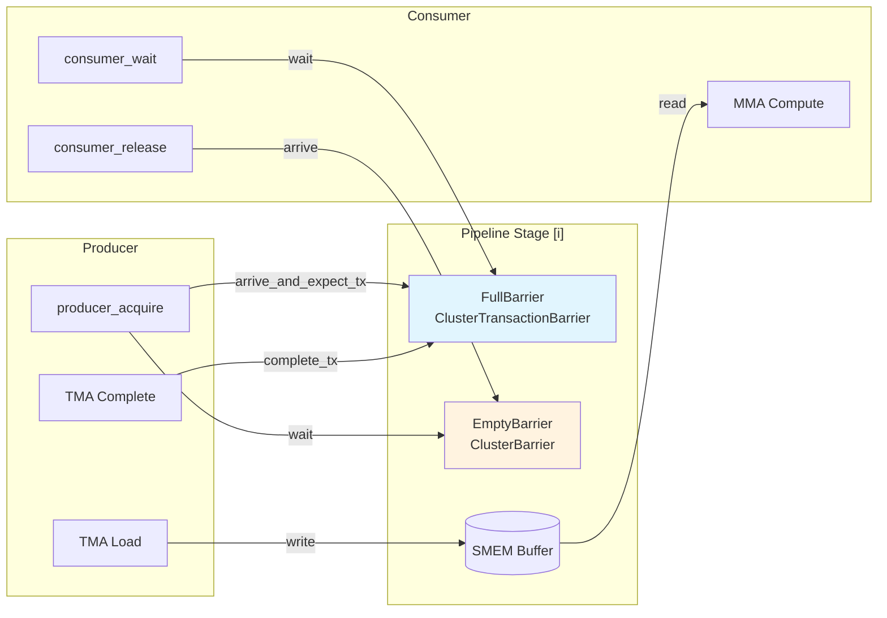
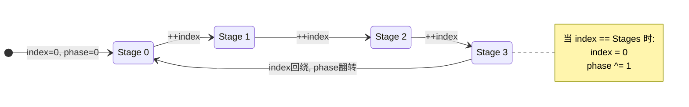
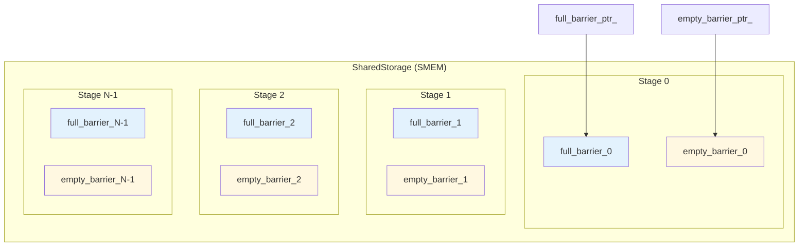
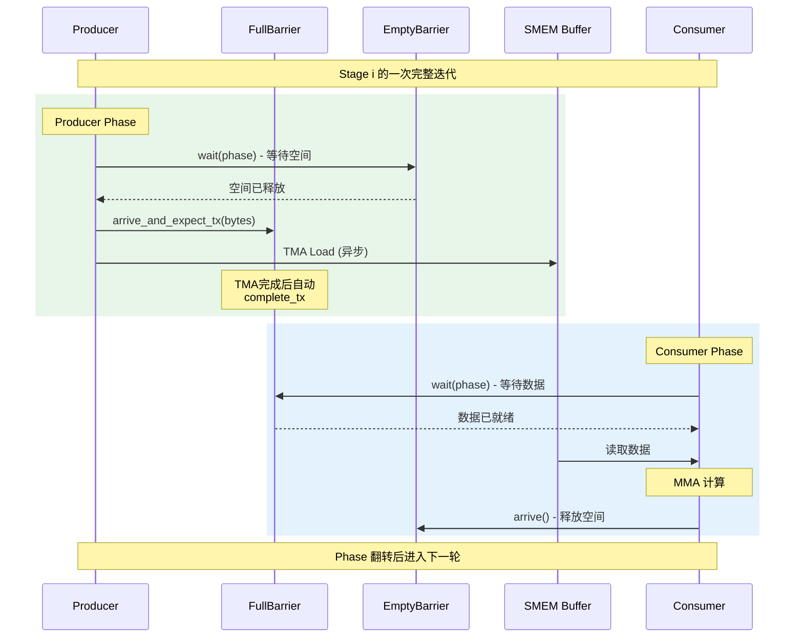

本文深入解析 CUTLASS SM90 Pipeline 机制及其底层 mbarrier PTX 指令的映射关系。所有代码引用均来自 NVIDIA CUTLASS 官方仓库。

<!-- more -->

## 1. mbarrier 原理

### 1.1 什么是 mbarrier

`mbarrier`（Memory Barrier）是 NVIDIA Hopper (SM90) 架构引入的硬件同步原语，存储在共享内存（SMEM）中。它是一个 64-bit 的硬件对象，支持：

- **到达计数（Arrival Counting）**：追踪有多少线程已经到达 barrier
- **事务计数（Transaction Counting）**：追踪 TMA 传输了多少字节（仅 `ClusterTransactionBarrier`）
- **Phase 位**：用于区分不同轮次的同步

### 1.2 mbarrier 64-bit 结构

| 字段 | 位数 | 描述 |
|-----|------|------|
| Phase Bit | 1 | 完成时翻转，用于区分不同轮次 |
| Pending TX Count | ~20 | 期望传输的字节数（TMA 完成时递减） |
| Arrival Count | ~20 | 剩余需要 arrive 的线程数 |

**完成条件**：
```
Pending TX Count == 0 AND Arrival Count == 0 → Phase Bit 翻转
```

### 1.3 Phase-Parity 机制

Phase 位是 mbarrier 实现循环复用的关键：

1. Barrier 初始化时 phase = 0
2. 当所有条件满足（到达计数和事务计数都归零），phase 翻转（0→1 或 1→0）
3. `try_wait.parity` 指令检查当前 phase 是否匹配期望值
4. 这样同一个 barrier 可以在不同迭代中重复使用

### 1.4 两种 Barrier 类型

CUTLASS 定义了两种 barrier 类型：

| 类型 | 用途 | 完成条件 |
|-----|------|---------|
| `ClusterBarrier` | 纯到达计数 | Arrival Count == 0 |
| `ClusterTransactionBarrier` | 到达 + 事务计数 | Arrival Count == 0 AND TX Count == 0 |

源码位置：[barrier.h](https://github.com/NVIDIA/cutlass/blob/main/include/cutlass/arch/barrier.h)

### 1.5 双 Barrier 架构

Pipeline 使用双 Barrier 实现生产者-消费者同步：



| Barrier | 类型 | 谁 Signal | 谁 Wait | 含义 |
|---------|------|----------|---------|------|
| **FullBarrier** | `ClusterTransactionBarrier` | Producer (TMA) | Consumer | "Data is ready" |
| **EmptyBarrier** | `ClusterBarrier` | Consumer | Producer | "Buffer is free" |

**语义说明**：

```
┌─────────────────────────────────────────────────────────────┐
│  Full Barrier (数据就绪):                                    │
│    - Producer 完成写入后 arrive                             │
│    - Consumer wait 此 barrier 后才能读取                    │
│                                                             │
│  Empty Barrier (buffer 空闲):                               │
│    - Consumer 消费完后 arrive                               │
│    - Producer wait 此 barrier 后才能重用 buffer            │
└─────────────────────────────────────────────────────────────┘
```

---

## 2. PipelineState 详解

`PipelineState` 是 Pipeline 的状态追踪器，管理循环缓冲区中的当前位置。

### 2.1 数据结构定义

```cpp
// 源码: include/cutlass/pipeline/sm90_pipeline.hpp:170-250
template<uint32_t Stages_>
struct PipelineState {

  static constexpr uint32_t Stages = Stages_;

  int index_ = 0;        // 当前 stage 索引 (0 到 Stages-1)
  uint32_t phase_ = 0;   // 当前 phase (0 或 1)，每绕回一次翻转
  uint32_t count_ = 0;   // 总迭代次数

  CUTLASS_DEVICE
  PipelineState(): index_{}, phase_{}, count_{} {}

  CUTLASS_DEVICE
  PipelineState(int index, uint32_t phase, uint32_t count)
    : index_(index)
    , phase_(phase)
    , count_(count) {}
};
```

### 2.2 成员变量说明

| 成员 | 类型 | 描述 |
|-----|------|------|
| `index_` | int | 当前 stage 在循环缓冲区中的索引，范围 [0, Stages-1] |
| `phase_` | uint32_t | 当前 phase 值，0 或 1，用于 barrier 同步 |
| `count_` | uint32_t | 总迭代计数，用于追踪已处理多少次 |

### 2.3 自增操作符

```cpp
// 源码: include/cutlass/pipeline/sm90_pipeline.hpp:203-213
CUTLASS_DEVICE
void operator++() {
  if constexpr (Stages > 0) {
    ++index_;
    ++count_;
    if (index_ == Stages) {
      index_ = 0;        // 回绕到开头
      phase_ ^= 1;       // 翻转 phase
    }
  }
}
```

**关键点**：当 `index_` 从 `Stages-1` 回绕到 `0` 时，`phase_` 翻转。这确保了 barrier 能区分不同轮次的操作。



### 2.4 advance 方法

```cpp
// 源码: include/cutlass/pipeline/sm90_pipeline.hpp:228-244
CUTLASS_DEVICE
PipelineState& advance(uint32_t num_iterations) {
  if constexpr (Stages > 0) {
    // 判断是否需要翻转 phase
    if ((num_iterations < Stages) && (index_ + num_iterations) >= Stages ) {
      phase_ ^= 1;
    }
    if ((num_iterations >= Stages) && (((index_ + num_iterations) / Stages) % 2) == 1) {
      phase_ ^= 1;
    }
    index_ = (index_ + num_iterations) % Stages;
    count_ += num_iterations;
  }
  return *this;
}
```

### 2.5 访问器方法

```cpp
CUTLASS_DEVICE int index() const { return index_; }
CUTLASS_DEVICE uint32_t phase() const { return phase_; }
CUTLASS_DEVICE uint32_t count() const { return count_; }
```

### 2.6 Producer 起始状态

```cpp
// 源码: include/cutlass/pipeline/sm90_pipeline.hpp:252-260
template<class Pipeline>
CUTLASS_DEVICE
PipelineState<Pipeline::Stages> make_producer_start_state() {
  // Producer 以相反的 phase 开始，因为缓冲区初始为空
  constexpr int InitialProducerStage = 0;
  constexpr uint32_t InitialProducerPhase = 1;  // 注意：phase 为 1
  constexpr uint32_t InitialProducerCount = 0;
  return {InitialProducerStage, InitialProducerPhase, InitialProducerCount};
}
```

**重要**：Producer 初始 phase 为 1，而 Consumer 初始 phase 为 0。这是因为缓冲区一开始是空的，Producer 需要先填充数据。

---

## 3. PipelineTmaAsync 详解

`PipelineTmaAsync` 是 SM90 上用于 TMA 异步加载的 Pipeline 类，实现了生产者-消费者同步模式。

源码位置：[sm90_pipeline.hpp](https://github.com/NVIDIA/cutlass/blob/main/include/cutlass/pipeline/sm90_pipeline.hpp)

### 3.1 类型定义

```cpp
// 源码: include/cutlass/pipeline/sm90_pipeline.hpp:270-278
template <int Stages_>
class PipelineTmaAsync {
public:
  using FullBarrier = cutlass::arch::ClusterTransactionBarrier;
  using EmptyBarrier = cutlass::arch::ClusterBarrier;
  using ProducerBarrierType = FullBarrier::ValueType;   // uint64_t
  using ConsumerBarrierType = EmptyBarrier::ValueType;  // uint64_t
  static constexpr uint32_t Stages = Stages_;
  using PipelineState = cutlass::PipelineState<Stages>;
  // ...
};
```

| 类型别名 | 实际类型 | 用途 |
|---------|---------|------|
| `FullBarrier` | `ClusterTransactionBarrier` | 数据就绪信号，支持事务计数 |
| `EmptyBarrier` | `ClusterBarrier` | 空间释放信号，纯到达计数 |
| `ProducerBarrierType` | `uint64_t` | Full barrier 的原始值类型 |
| `ConsumerBarrierType` | `uint64_t` | Empty barrier 的原始值类型 |

### 3.2 SharedStorage 结构

```cpp
// 源码: include/cutlass/pipeline/sm90_pipeline.hpp:280-283
struct SharedStorage {
  FullBarrier full_barrier_[Stages];   // 每个 stage 一个 full barrier
  EmptyBarrier empty_barrier_[Stages]; // 每个 stage 一个 empty barrier
};
```

每个 Pipeline stage 都有一对 barrier：
- **full_barrier_**：Producer 填充数据后 signal，Consumer 等待
- **empty_barrier_**：Consumer 使用完毕后 signal，Producer 等待



### 3.3 ThreadCategory 枚举

```cpp
// 源码: include/cutlass/pipeline/sm90_pipeline.hpp:285-290
enum class ThreadCategory {
  NonParticipant,    // 不参与 Pipeline 操作
  Producer,          // 仅作为生产者
  Consumer,          // 仅作为消费者
  ProducerConsumer   // 同时是生产者和消费者
};
```

### 3.4 Params 参数结构

```cpp
// 源码: include/cutlass/pipeline/sm90_pipeline.hpp:292-299
struct Params {
  uint32_t transaction_bytes = 0;    // 每次 TMA 传输的字节数
  ThreadCategory role = ThreadCategory::NonParticipant;  // 线程角色
  uint32_t is_leader = 0;            // 是否为 leader 线程（负责 barrier 操作）
  uint32_t num_consumers = 0;        // Consumer 线程总数
  uint32_t num_producers = 1;        // Producer 线程总数
  int initializing_warp = 0;         // 负责初始化 barrier 的 warp
};
```

### 3.5 私有成员变量

```cpp
// 源码: include/cutlass/pipeline/sm90_pipeline.hpp:494-499
private:
  uint32_t dst_blockid_ = 0;              // 目标 CTA ID（用于 cluster 内通信）
  uint32_t is_signaling_thread_ = 0;      // 是否负责发送 arrive 信号
  FullBarrier *full_barrier_ptr_ = nullptr;   // 指向 full barrier 数组
  EmptyBarrier *empty_barrier_ptr_ = nullptr; // 指向 empty barrier 数组
  Params params_;                         // 配置参数
```

| 成员 | 描述 |
|-----|------|
| `dst_blockid_` | 在 cluster 模式下，标识要发送 arrive 信号的目标 CTA |
| `is_signaling_thread_` | 标记此线程是否负责发送 arrive 信号（避免重复发送） |
| `full_barrier_ptr_` | 指向共享内存中 FullBarrier 数组的指针 |
| `empty_barrier_ptr_` | 指向共享内存中 EmptyBarrier 数组的指针 |
| `params_` | 保存构造时传入的配置参数 |

### 3.6 构造函数

```cpp
// 源码: include/cutlass/pipeline/sm90_pipeline.hpp:326-377
template<class ClusterShape, class InitBarriers, class InitMasks>
CUTLASS_DEVICE
PipelineTmaAsync(SharedStorage& storage, Params params, ClusterShape cluster_shape,
                 InitBarriers = {}, InitMasks = {})
    : params_(params)
    , full_barrier_ptr_(&storage.full_barrier_[0])
    , empty_barrier_ptr_(&storage.empty_barrier_[0]) {

  int warp_idx = canonical_warp_idx_sync();
  int thread_idx = threadIdx.x;

  // 初始化 barrier（如果需要）
  if constexpr (cute::is_same_v<InitBarriers, cute::true_type>) {
    init_barriers(storage, params_, cluster_shape);
  }

  // 初始化信号掩码（用于 cluster 内通信）
  if constexpr (cute::is_same_v<InitMasks, cute::true_type>) {
    dim3 block_id = cute::block_id_in_cluster();
    auto cluster_size = cute::size(cluster_shape);

    if (cluster_size == 1) {
      is_signaling_thread_ = true;
      dst_blockid_ = 0;
    }
    else {
      // 在 warp group 内分配 arrive 职责
      // ...
    }
  }
}
```

### 3.7 Barrier 初始化

```cpp
// 源码: include/cutlass/pipeline/sm90_pipeline.hpp:301-324
template <class ClusterShape>
static CUTLASS_DEVICE void
init_barriers(SharedStorage& storage, Params params, ClusterShape cluster_shape) {
  int warp_idx = canonical_warp_idx_sync();
  bool is_initializing_warp = (warp_idx == params.initializing_warp);

  if (is_initializing_warp) {
    uint32_t const producer_arv_cnt = params.num_producers;
    uint32_t multicast_consumer_arrival_count = params.num_consumers;

    // Cluster 模式下调整 arrival count
    if (cute::size(cluster_shape) > 1) {
      uint32_t const num_consumer_warpgroups_per_cluster =
          cute::ceil_div(params.num_consumers, NumThreadsPerWarpGroup);
      multicast_consumer_arrival_count =
          (cute::size<0>(cluster_shape) + cute::size<1>(cluster_shape) - 1) *
          num_consumer_warpgroups_per_cluster;
    }

    // 初始化 barrier 对
    initialize_barrier_array_pair_aligned(...);
  }
  cutlass::arch::fence_barrier_init();
}
```

**fence_barrier_init 的作用**：

```cpp
CUTLASS_DEVICE
void fence_barrier_init() {
    asm volatile(
        "fence.mbarrier_init.release.cluster;"
        ::);
}
```

确保 barrier 初始化对 cluster 内所有 CTA 可见：

```
Thread 0 (初始化):                其他线程 / 其他 CTA:
    │                                 │
    ▼                                 │
mbarrier.init(...)                    │
mbarrier.init(...)                    │ 等待...
    │                                 │
    ▼                                 │
fence.mbarrier_init.release ──────────┼──→ 现在可见
    │                                 │
    ▼                                 ▼
                            可以安全使用 barrier
```

### 3.8 Arrival Count 详解

**Cluster Size == 1（无 Multicast）**：

```cpp
multicast_consumer_arrival_count = params.num_consumers;  // 线程数
```

每个线程都执行 arrive。

**Cluster Size > 1（Multicast）**：

```cpp
multicast_consumer_arrival_count =
    (ClusterM + ClusterN - 1) * num_consumer_warpgroups_per_cluster;
```

**2×2 Cluster 计算示例**：

```cpp
// ClusterM = 2, ClusterN = 2
// num_consumer_warpgroups = 2 (每 CTA)

// 接收 multicast 的有效 CTA 数
unique_cta_count = ClusterM + ClusterN - 1 = 2 + 2 - 1 = 3

// 每个有效 CTA 的 warpgroups
warpgroups_per_cta = 2

// 总 arrival count
multicast_consumer_arrival_count = 3 * 2 = 6
```

**为什么是 ClusterM + ClusterN - 1？**

```
Cluster = (2, 2), 以 CTA(0,0) 的 Producer 为例:

              N
           ┌─────────────────────────┐
           │ CTA(0,0)  │  CTA(0,1)  │ ← B multicast (同一行)
    M      │  (本CTA)  │    (B)     │
           ├───────────┼────────────┤
           │ CTA(1,0)  │  CTA(1,1)  │
           │   (A)     │   (无关)   │
           └─────────────────────────┘
                ↑
           A multicast (同一列)

接收数据的 CTA:
  - CTA(0,0): 接收 A 和 B (本 CTA)
  - CTA(1,0): 接收 A
  - CTA(0,1): 接收 B

总计: 3 个 CTA = 2 + 2 - 1 ✓
CTA(1,1) 不接收 CTA(0,0) 的任何数据！
```

---

## 4. Producer API 详解

### 4.1 producer_try_acquire

非阻塞尝试获取缓冲区空间：

```cpp
// 源码: include/cutlass/pipeline/sm90_pipeline.hpp:419-422 (public)
CUTLASS_DEVICE
ProducerToken producer_try_acquire(PipelineState state, uint32_t skip_wait = false) {
  return producer_try_acquire(state.index(), state.phase(), skip_wait);
}

// 源码: include/cutlass/pipeline/sm90_pipeline.hpp:501-509 (private)
CUTLASS_DEVICE
ProducerToken producer_try_acquire(uint32_t stage, uint32_t phase, uint32_t skip_wait) {
  detail::pipeline_check_is_producer(params_.role);
  if (skip_wait) {
    return {BarrierStatus::WaitDone};
  }
  bool barrier_status = empty_barrier_ptr_[stage].try_wait(phase);
  return {static_cast<BarrierStatus>(barrier_status)};
}
```

**PTX 指令**：
```asm
mbarrier.try_wait.parity.shared::cta.b64 P1, [smem_addr], phase;
selp.b32 result, 1, 0, P1;
```

### 4.2 producer_acquire

阻塞等待缓冲区空间，并设置期望传输字节数：

```cpp
// 源码: include/cutlass/pipeline/sm90_pipeline.hpp:424-427 (public)
CUTLASS_DEVICE
void producer_acquire(PipelineState state) {
  producer_acquire(state.index(), state.phase());
}

// 源码: include/cutlass/pipeline/sm90_pipeline.hpp:511-528 (private)
CUTLASS_DEVICE
void producer_acquire(uint32_t stage, uint32_t phase) {
  // Step 1: 等待 Consumer 释放空间
  empty_barrier_ptr_[stage].wait(phase);

  // Step 2: Leader 线程设置期望传输字节数
  if (params_.is_leader) {
    full_barrier_ptr_[stage].arrive_and_expect_tx(params_.transaction_bytes);
  }
}
```

**PTX 指令**：

等待部分（spin loop）：
```asm
LAB_WAIT:
    mbarrier.try_wait.parity.shared::cta.b64 P1, [smem_addr], phase, 0x989680;
    @P1 bra DONE;
    bra LAB_WAIT;
DONE:
```

设置期望字节数：
```asm
mbarrier.arrive.expect_tx.shared::cta.b64 _, [smem_addr], transaction_bytes;
```

### 4.3 producer_acquire (带 token)

```cpp
// 源码: include/cutlass/pipeline/sm90_pipeline.hpp:530-550
CUTLASS_DEVICE
void producer_acquire(uint32_t stage, uint32_t phase, ProducerToken barrier_token) {
  detail::pipeline_check_is_producer(params_.role);
  // 如果 try_acquire 已经成功，跳过等待
  if (barrier_token != BarrierStatus::WaitDone) {
    empty_barrier_ptr_[stage].wait(phase);
  }

  if (params_.is_leader) {
    full_barrier_ptr_[stage].arrive_and_expect_tx(params_.transaction_bytes);
  }
}
```

### 4.4 producer_expect_transaction

额外增加期望传输字节数（用于多次 TMA 操作）：

```cpp
// 源码: include/cutlass/pipeline/sm90_pipeline.hpp:552-558
CUTLASS_DEVICE
void producer_expect_transaction(uint32_t stage, uint32_t transaction_bytes) {
  detail::pipeline_check_is_producer(params_.role);
  if (params_.is_leader) {
    full_barrier_ptr_[stage].expect_transaction(transaction_bytes);
  }
}
```

**PTX 指令**：
```asm
mbarrier.expect_tx.shared::cta.b64 [smem_addr], transaction_bytes;
```

### 4.5 producer_commit

TMA 完成后由硬件自动触发：

```cpp
// 源码: include/cutlass/pipeline/sm90_pipeline.hpp:560-587
CUTLASS_DEVICE
void producer_commit(uint32_t stage, uint32_t bytes) {
  // 仅用于单元测试（无 TMA 时手动提交）
  #if CUTLASS_UNIT_TEST_PIPELINE
    if (params_.is_leader) {
      full_barrier_ptr_[stage].complete_transaction(bytes);
      // Cluster 模式下通知其他 CTA...
    }
  #endif
}
```

**PTX 指令**（TMA 硬件自动执行）：
```asm
mbarrier.complete_tx.shared::cluster.relaxed.cluster.b64 [smem_addr], transaction_bytes;
```

### 4.6 producer_get_barrier

返回 barrier 指针供 TMA 使用：

```cpp
// 源码: include/cutlass/pipeline/sm90_pipeline.hpp:638-641
CUTLASS_DEVICE
ProducerBarrierType* producer_get_barrier(uint32_t stage) {
  return reinterpret_cast<ProducerBarrierType*>(&full_barrier_ptr_[stage]);
}
```

### 4.7 producer_tail

防止 Producer block 过早退出：

```cpp
// 源码: include/cutlass/pipeline/sm90_pipeline.hpp:447-454
CUTLASS_DEVICE
void producer_tail(PipelineState state) {
  detail::pipeline_check_is_producer(params_.role);
  for (int count = 0; count < Stages; ++count) {
    empty_barrier_ptr_[state.index()].wait(state.phase());
    ++state;
  }
}
```

---

## 5. Consumer API 详解

### 5.1 consumer_try_wait

非阻塞尝试等待数据就绪：

```cpp
// 源码: include/cutlass/pipeline/sm90_pipeline.hpp:590-597
CUTLASS_DEVICE
ConsumerToken consumer_try_wait(uint32_t stage, uint32_t phase, uint32_t skip_wait) {
  detail::pipeline_check_is_consumer(params_.role);
  if (skip_wait) {
    return {BarrierStatus::WaitDone};
  }
  bool barrier_status = full_barrier_ptr_[stage].try_wait(phase);
  return {static_cast<BarrierStatus>(barrier_status)};
}
```

返回值：
- `BarrierStatus::WaitDone` (1)：数据已就绪
- `BarrierStatus::WaitAgain` (0)：数据未就绪

### 5.2 consumer_test_wait

与 try_wait 类似，但使用 `test_wait` PTX 指令：

```cpp
// 源码: include/cutlass/pipeline/sm90_pipeline.hpp:599-607
CUTLASS_DEVICE
ConsumerToken consumer_test_wait(uint32_t stage, uint32_t phase, uint32_t skip_wait) {
  detail::pipeline_check_is_consumer(params_.role);
  if (skip_wait) {
    return {BarrierStatus::WaitDone};
  }
  bool barrier_status = full_barrier_ptr_[stage].test_wait(phase);
  return {static_cast<BarrierStatus>(barrier_status)};
}
```

### 5.3 consumer_wait

阻塞等待数据就绪：

```cpp
// 源码: include/cutlass/pipeline/sm90_pipeline.hpp:609-623
CUTLASS_DEVICE
void consumer_wait(uint32_t stage, uint32_t phase) {
  detail::pipeline_check_is_consumer(params_.role);
  full_barrier_ptr_[stage].wait(phase);
}

// 带 token 版本
CUTLASS_DEVICE
void consumer_wait(uint32_t stage, uint32_t phase, ConsumerToken barrier_token) {
  detail::pipeline_check_is_consumer(params_.role);
  if (barrier_token == BarrierStatus::WaitAgain) {
    full_barrier_ptr_[stage].wait(phase);
  }
  // 如果已经 WaitDone，直接返回
}
```

### 5.4 consumer_release

通知 Producer 空间已释放：

```cpp
// 源码: include/cutlass/pipeline/sm90_pipeline.hpp:625-636
CUTLASS_DEVICE
void consumer_release(uint32_t stage, uint32_t skip = false) {
  detail::pipeline_check_is_consumer(params_.role);
  empty_barrier_ptr_[stage].arrive(dst_blockid_, is_signaling_thread_ & (!skip));
}
```

**PTX 指令**：

本地 CTA arrive：
```asm
mbarrier.arrive.shared::cta.b64 _, [smem_addr];
```

远程 Cluster arrive：
```asm
mapa.shared::cluster.u32 remAddr32, smem_addr, cta_id;
mbarrier.arrive.shared::cluster.b64 _, [remAddr32];
```

---

## 6. Pipeline API 到 PTX 映射总览

| Pipeline API | Barrier 类型 | PTX 指令 |
|--------------|-------------|---------|
| `producer_try_acquire` | EmptyBarrier | `mbarrier.try_wait.parity` (单次) |
| `producer_acquire` (wait) | EmptyBarrier | `mbarrier.try_wait.parity` (spin) |
| `producer_acquire` (leader) | FullBarrier | `mbarrier.arrive.expect_tx` |
| `producer_expect_transaction` | FullBarrier | `mbarrier.expect_tx` |
| `producer_commit` | FullBarrier | `mbarrier.complete_tx` (TMA 自动) |
| `consumer_try_wait` | FullBarrier | `mbarrier.try_wait.parity` (单次) |
| `consumer_test_wait` | FullBarrier | `mbarrier.test_wait.parity` |
| `consumer_wait` | FullBarrier | `mbarrier.try_wait.parity` (spin) |
| `consumer_release` | EmptyBarrier | `mbarrier.arrive` |

---

## 7. ClusterBarrier 实现

```cpp
// 源码: include/cutlass/arch/barrier.h:341-532
struct ClusterBarrier {
  using ValueType = uint64_t;

protected:
  ValueType barrier_;  // SMEM 中的 64-bit mbarrier 对象

public:
  // 初始化 barrier
  static void init(ValueType const* smem_ptr, uint32_t arrive_count) {
    uint32_t smem_addr = cute::cast_smem_ptr_to_uint(smem_ptr);
    asm volatile(
        "mbarrier.init.shared::cta.b64 [%1], %0;"
        : : "r"(arrive_count), "r"(smem_addr));
  }

  // 阻塞等待（spin loop）
  static void wait(ValueType const* smem_ptr, uint32_t phase) {
    uint32_t smem_addr = cute::cast_smem_ptr_to_uint(smem_ptr);
    uint32_t ticks = 0x989680;  // ~10M cycles 超时后重试
    asm volatile(
        ".reg .pred P1;\n"
        "LAB_WAIT:\n"
        "mbarrier.try_wait.parity.shared::cta.b64 P1, [%0], %1, %2;\n"
        "@P1 bra DONE;\n"
        "bra LAB_WAIT;\n"
        "DONE:"
        : : "r"(smem_addr), "r"(phase), "r"(ticks));
  }

  // 非阻塞尝试等待
  static bool try_wait(ValueType const* smem_ptr, uint32_t phase) {
    uint32_t smem_addr = cute::cast_smem_ptr_to_uint(smem_ptr);
    uint32_t waitComplete;
    asm volatile(
        ".reg .pred P1;\n"
        "mbarrier.try_wait.parity.shared::cta.b64 P1, [%1], %2;\n"
        "selp.b32 %0, 1, 0, P1;"
        : "=r"(waitComplete) : "r"(smem_addr), "r"(phase));
    return static_cast<bool>(waitComplete);
  }

  // 本地 arrive
  static void arrive(ValueType const* smem_ptr) {
    uint32_t smem_addr = cute::cast_smem_ptr_to_uint(smem_ptr);
    asm volatile(
        "mbarrier.arrive.shared::cta.b64 _, [%0];"
        : : "r"(smem_addr));
  }

  // 远程 cluster arrive
  static void arrive(ValueType const* smem_ptr, uint32_t cta_id, uint32_t pred) {
    uint32_t smem_addr = cute::cast_smem_ptr_to_uint(smem_ptr);
    if (pred) {
      asm volatile(
          ".reg .b32 remAddr32;\n"
          "mapa.shared::cluster.u32 remAddr32, %0, %1;\n"
          "mbarrier.arrive.shared::cluster.b64 _, [remAddr32];"
          : : "r"(smem_addr), "r"(cta_id));
    }
  }
};
```

---

## 8. ClusterTransactionBarrier 实现

```cpp
// 源码: include/cutlass/arch/barrier.h:538-693
struct ClusterTransactionBarrier : public ClusterBarrier {

  // Arrive + 设置期望传输字节数
  static void arrive_and_expect_tx(ValueType const* smem_ptr, uint32_t transaction_bytes) {
    uint32_t smem_addr = cute::cast_smem_ptr_to_uint(smem_ptr);
    asm volatile(
        "mbarrier.arrive.expect_tx.shared::cta.b64 _, [%1], %0;"
        : : "r"(transaction_bytes), "r"(smem_addr));
  }

  // 仅设置期望字节数（不 arrive）
  static void expect_transaction(ValueType const* smem_ptr, uint32_t transaction_bytes) {
    uint32_t smem_addr = cute::cast_smem_ptr_to_uint(smem_ptr);
    asm volatile(
        "mbarrier.expect_tx.shared::cta.b64 [%1], %0;"
        : : "r"(transaction_bytes), "r"(smem_addr));
  }

  // 完成传输（减少 pending 字节数）- TMA 硬件自动调用
  static void complete_transaction(
      ValueType const* smem_ptr, uint32_t dst_cta_id,
      uint32_t transaction_bytes, uint32_t pred = 1) {
    uint32_t smem_addr = cute::cast_smem_ptr_to_uint(smem_ptr);
    smem_addr = cute::set_block_rank(smem_addr, dst_cta_id);
    asm volatile(
        ".reg .pred p;\n"
        "setp.eq.u32 p, %2, 1;\n"
        "@p mbarrier.complete_tx.shared::cluster.relaxed.cluster.b64 [%1], %0;"
        : : "r"(transaction_bytes), "r"(smem_addr), "r"(pred));
  }
};
```

---

## 9. 完整工作流程示例

下图展示了 Producer 和 Consumer 之间的交互时序：



```cpp
// Producer 线程（TMA 加载器）
PipelineState producer_state = make_producer_start_state<Pipeline>();

for (int k = 0; k < num_tiles; ++k) {
  // 1. 获取缓冲区（等待空间 + 设置期望字节数）
  pipeline.producer_acquire(producer_state);

  // 2. 获取 barrier 指针供 TMA 使用
  auto* barrier = pipeline.producer_get_barrier(producer_state);

  // 3. 发起 TMA 加载（硬件自动完成 barrier）
  copy(tma_load, gmem_tensor, smem_tensor, barrier);

  ++producer_state;
}

// 4. 退出前等待所有 Consumer 完成
pipeline.producer_tail(producer_state);


// Consumer 线程（MMA 计算）
PipelineState consumer_state{0, 0, 0};  // phase = 0

for (int k = 0; k < num_tiles; ++k) {
  // 1. 尝试等待（非阻塞）
  auto token = pipeline.consumer_try_wait(consumer_state);

  // 2. 可以做一些其他工作...

  // 3. 如果需要，阻塞等待
  pipeline.consumer_wait(consumer_state, token);

  // 4. 使用 SMEM 数据进行 MMA 计算
  gemm(smem_tensor, accumulators);

  // 5. 释放缓冲区给 Producer
  pipeline.consumer_release(consumer_state);

  ++consumer_state;
}
```

---

## 10. 关键要点总结

1. **SM90 专属**：Pipeline 机制专为 NVIDIA Hopper 架构（SM90+）设计

2. **双 Barrier 架构**：
   - `FullBarrier`（ClusterTransactionBarrier）：Producer → Consumer，数据就绪信号
   - `EmptyBarrier`（ClusterBarrier）：Consumer → Producer，空间释放信号

3. **硬件加速**：TMA 完成时自动 signal barrier，无需软件干预

4. **Phase 机制**：phase 位使 barrier 可跨迭代复用

5. **Cluster 支持**：通过 `mapa` 指令实现跨 CTA 的 barrier 操作

6. **Leader 模式**：只有 leader 线程执行 barrier 的 arrive/expect_tx 操作，避免重复

---

## 参考资料

- [CUTLASS GitHub 仓库](https://github.com/NVIDIA/cutlass)
- [sm90_pipeline.hpp](https://github.com/NVIDIA/cutlass/blob/main/include/cutlass/pipeline/sm90_pipeline.hpp)
- [barrier.h](https://github.com/NVIDIA/cutlass/blob/main/include/cutlass/arch/barrier.h)
- [NVIDIA PTX ISA - mbarrier](https://docs.nvidia.com/cuda/parallel-thread-execution/index.html#parallel-synchronization-and-communication-instructions-mbarrier)
- [CUDA Programming Guide - Asynchronous Barrier](https://docs.nvidia.com/cuda/cuda-c-programming-guide/index.html#asynchronous-barrier)
